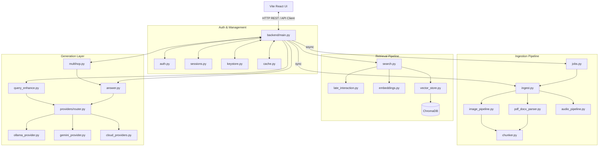
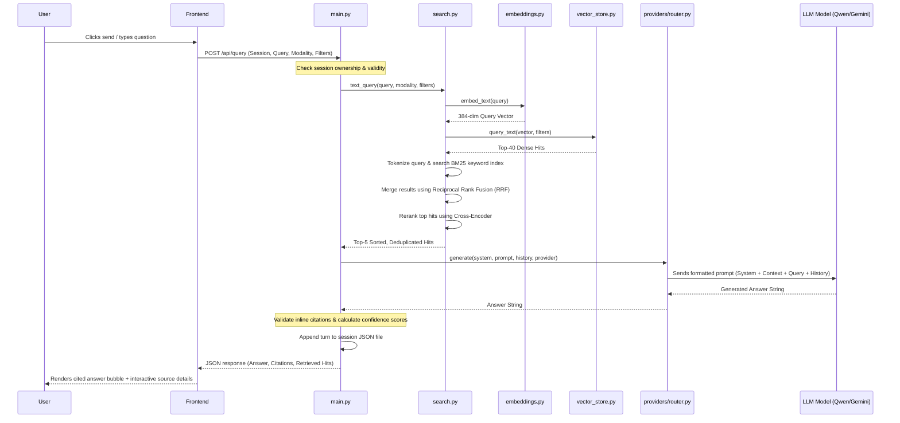
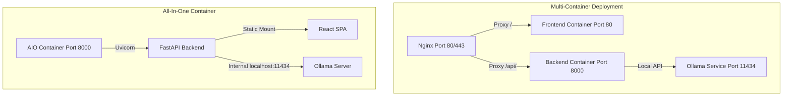

# Multimodal RAG Project — Complete Technical Documentation

Welcome to the complete technical, architectural, and educational documentation manual for the **Multimodal Offline RAG (Retrieval-Augmented Generation) System**.

This document is designed to guide anyone—from an absolute beginner who knows nothing about AI, databases, or programming, to an advanced software architect or developer—through the inner workings, code layout, data flows, and configuration options of this project.

---

# Part 1 — Beginner-Friendly Introduction

To understand this project, we must first break down the core concepts in simple terms. If you are already an experienced AI developer, you can skip to **Part 2 (Project Purpose & Architecture)**.

## What is AI?
**AI (Artificial Intelligence)** is the field of computer science dedicated to building systems that can perform tasks that normally require human intelligence. This includes recognizing images, transcribing spoken voice, translating languages, and generating human-like text answers.

## What is an LLM?
An **LLM (Large Language Model)** is a computer program trained on a massive amount of text from the internet. You can think of it as a highly advanced auto-complete engine. If you give it a sentence (called a **prompt**), it predicts the most logical words to follow, allowing it to write essays, answer questions, and write code.
* *Analogy:* An LLM is like a student who has read every book in the library. They are very smart and can write beautiful essays on any general topic, but they might forget specific details, get facts mixed up, or know nothing about your private files.

## What is a Document?
In this system, a **document** refers to text files (like PDF or Microsoft Word `.docx` files) that contain information you want to search.

## What is Multimodal Data?
Human beings experience the world through multiple senses: we read **text**, look at **images**, and listen to **audio** (sound/speech). In AI, these different formats are called **modalities**.
* **Text data:** Raw text lines found in files, pages, and spreadsheets.
* **Image data:** Visual media such as photos, screenshots, and diagrams.
* **Audio data:** Spoken speech or sound recordings (like MP3 or WAV files).

A **multimodal AI system** is a system that can understand and process more than one of these formats at the same time.

## What is an Embedding?
An **embedding** is how a computer translates human concepts (like text, images, or audio) into a format it can understand: math.
* *Analogy:* Imagine a massive map of the universe. Every word or image is placed at a specific location on this map. Words with similar meanings (like "dog" and "puppy") are placed very close to each other. Words with different meanings (like "dog" and "calculator") are placed very far apart.
* An embedding is simply the coordinate (a list of numbers) of where that word or image is located on the map. This list of numbers is called a **vector**.

## What is a Vector?
A **vector** is a list of numbers representing coordinates in a multi-dimensional space. While a coordinate on a regular map has 2 numbers (Latitude and Longitude), an AI vector has hundreds of numbers (dimensions) representing different aspects of meaning.
* For example, the text embedding model in this project uses **384 numbers** to describe the location of a single chunk of text. The image embedding model (CLIP) uses **512 numbers** to describe a single image.

## What is a Vector Database?
A traditional database (like Excel or SQL) stores data in rows and columns and searches for exact matches (like looking up an employee ID).
A **vector database** stores vectors (the coordinates of meaning) and allows the computer to perform a **similarity search**. It calculates which coordinates in the database are closest to your query's coordinates. This is called **semantic similarity** (searching by meaning, not by exact keyword matches).
* *Example:* If you search for *"kitty"* in a traditional database, it will miss documents containing only the word *"cat"*. A vector database knows that the vector for *"kitty"* is close to *"cat"*, so it retrieves the correct documents.

## What is Retrieval?
**Retrieval** is the process of searching a database and fetching the most relevant pieces of information matching a query.

## What is RAG (Retrieval-Augmented Generation)?
Although LLMs are very smart, they suffer from **hallucinations**—they sometimes make up facts when they don't know the answer. They also don't have access to your private files.
**RAG (Retrieval-Augmented Generation)** solves this problem in three steps:
1. **Retrieval (Find):** The system searches your private documents/images/audio for paragraphs relevant to the user's question.
2. **Augmented (Add):** The system takes those relevant paragraphs (the context) and pastes them directly into the prompt alongside the user's question.
3. **Generation (Answer):** The LLM reads the context and writes an answer based *only* on the provided information, citing the sources.

```text
User Question: "What was our revenue in 2024?"
       │
       ▼
1. RETRIEVE relevant paragraphs from vector database:
   -> [1] "Revenue in 2024 reached $5M, up 20% from last year."
       │
       ▼
2. AUGMENT (create prompt):
   "Use ONLY this source to answer the question: [1] Revenue in 2024 was $5M.
    Question: What was our revenue in 2024?"
       │
       ▼
3. GENERATION (LLM writes answer):
   "Our revenue in 2024 was $5M [1]."
```

## What makes this project Multimodal?
Normally, RAG systems only search text documents. This project is **multimodal** because it allows you to ingest:
* **Documents (PDF, DOCX):** Reads the pages, extracts text, extracts tables, and extracts embedded images.
* **Images (PNG, JPG, etc.):** Runs **OCR (Optical Character Recognition)** to read text inside the image (e.g. screenshots), runs a **captioning model** to describe what the image shows, and runs a **visual model** (CLIP) to map the visual content.
* **Audio (MP3, WAV, etc.):** Transcribes spoken speech into text with precise timestamps (timecodes).

You can search across all of these formats in one shared space. For example:
* You can query with text (*"show me the email screenshot"*) to retrieve an image.
* You can query with an image to find related documents or audio.
* You can query with an audio clip to find matching files.

---

# Part 2 — Project Purpose & Overview

## Problem Statement
Organizations and individuals have large volumes of information stored in different formats (documents, scanned receipts, system screenshots, call logs, meeting recordings). Searching across these formats is time-consuming and often requires upload to cloud APIs, which compromises privacy.

## Proposed Solution
An **offline, multi-user, multimodal RAG system** that index documents, images, and audio into a single, unified search space.
* **100% Local & Private:** Runs entirely on the user's hardware. No cloud APIs or external servers are required, meaning zero data leakage and no API costs.
* **Multi-User Isolation:** Each user has their own private account. Users register with an email and password, and all chat history, uploads, and search indexes are strictly isolated to their own account.
* **Granular Citations:** Every retrieved chunk links back to its precise source—showing the exact PDF page, the audio transcript segment (with a clickable timecode to listen), or the image preview with its OCR text.
* **Scoped Search:** Users can restrict queries to specific files or modalities (e.g., search *only* within a specific audio recording).

```text
Input Media (PDF, DOCX, PNG, JPG, MP3, WAV)
                         │
                         ▼
┌─────────────────── INGESTION PIPELINE ───────────────────┐
│  • Documents -> Page text extraction + Tables           │
│  • Images    -> PaddleOCR text + BLIP Captions + CLIP   │
│  • Audio     -> Whisper transcription + timecodes       │
└───────────────────────────┬──────────────────────────────┘
                            │ (Generate embeddings)
                            ▼
┌──────────────────── CHROMA VECTOR DB ────────────────────┐
│  • rag_text collection  (384-dim text/OCR/captions)      │
│  • rag_image collection (512-dim CLIP visual vectors)    │
└───────────────────────────┬──────────────────────────────┘
                            │ (User queries via Web UI)
                            ▼
┌──────────────────── RETRIEVAL & FUSION ──────────────────┐
│  • Dense Vector Search + BM25 Keyword Search             │
│  • Reciprocal Rank Fusion (RRF)                          │
│  • Cross-Encoder Reranking                               │
└───────────────────────────┬──────────────────────────────┘
                            │ (Paste retrieved context)
                            ▼
┌──────────────────── GENERATION LAYER ────────────────────┐
│  • Ollama (Local Qwen LLM) or Cloud Fallback             │
│  • Citation matching & Faithfulness checks               │
└───────────────────────────┬──────────────────────────────┘
                            ▼
                     Cited Answer &
                   Interactive Media
```

---

# Part 3 — Complete Technology Stack

| Layer | Technology | Version | Purpose | Why Used |
| :--- | :--- | :--- | :--- | :--- |
| **Programming Language** | Python | 3.10 / 3.11 | Backend logic and AI pipeline execution | Industry standard for machine learning, data processing, and FastAPI backends. |
| **Frontend Framework** | React | 18.x | Dynamic, responsive user interface | Component-based UI structure, perfect for building real-time chat and document libraries. |
| **Frontend Language** | TypeScript | 5.x | Static typing for frontend code | Catches coding bugs early and mirrors the API models defined in the backend. |
| **Styling (CSS)** | TailwindCSS | 3.x | Visual styling | Utility-first CSS framework allowing rapid development of modern, dark-mode-ready layouts. |
| **Build Tool** | Vite | 5.x | Frontend build tool and bundler | Instant server startup and hot-reloading for rapid development. |
| **API Framework** | FastAPI | 0.115.6 | Backend REST API server | High-performance, asynchronous Python framework with automatic documentation (`/docs`). |
| **WSGI Server** | Uvicorn | 0.34.0 | Running the FastAPI backend | Fast ASGI server that manages incoming web traffic to the Python app. |
| **Vector Database** | ChromaDB | Latest | Vector indexing and retrieval | Lightweight, embedded (runs inside the Python process without requiring a separate server). |
| **Local LLM Server** | Ollama | Latest | Local LLM hosting | Easy local deployment of LLMs with efficient CPU/GPU execution and a clean REST API. |
| **Local LLM Model** | Qwen | qwen3:8b | Generating grounded answers | Excellent multilingual capabilities and reasoning performance on consumer hardware. |
| **Text Embedding** | Sentence Transformers | 3.3.1 | Generating text vectors | Simple library to compute local dense embeddings for document chunks, transcripts, and OCR. |
| **Text Model** | MiniLM | MiniLM-L12-v2 | Multilingual sentence embedding model | Fast, compact (33M parameters), supports 50+ languages, outputs 384-dimensional vectors. |
| **Visual Embedding** | CLIP | ViT-B-32 | Cross-modal text-image search | Aligns images and text into one shared vector space, outputting 512-dimensional vectors. |
| **Image OCR** | PaddleOCR | 3.7.0 | Advanced deep-learning OCR | Highly accurate Chinese/English OCR model. Far outperforms Tesseract on screenshots. |
| **Image OCR Fallback** | Tesseract OCR | 0.3.13 | Rule-based OCR fallback | Solid, classic OCR engine used as a reliable fallback on systems where PaddleOCR fails. |
| **Image Captioning** | BLIP | blip-base | Summarizing image contents | Pre-trained transformer that automatically generates text captions for images. |
| **Speech-to-Text** | Faster-Whisper | 1.1.0 | Offline audio transcription | CTranslate2 implementation of OpenAI's Whisper model. Up to 4x faster and uses less memory. |
| **Document Parser** | PyMuPDF (fitz) | 1.25.1 | PDF parsing and OCR rendering | High-speed PDF reader that extracts text pages, extracts tables, and saves embedded images. |
| **Document Parser** | python-docx | 1.1.2 | DOCX file parsing | Reads paragraphs and tables in Microsoft Word files. |
| **API Cryptography** | cryptography | 42.0.0 | Encrypting cloud API keys | Provides the Fernet recipe (AES-128-CBC + HMAC-SHA256) to secure API keys at rest. |
| **Keyword Search** | rank-bm25 | 0.2.2 | Keyword search capability | Traditional keyword scoring algorithm used to complement dense vector searches. |
| **Reranking Model** | CrossEncoder | ms-marco-6-v2 | Reranking retrieved documents | Re-evaluates similarity by feeding query and documents together, boosting RAG accuracy. |
| **Webview Container** | PyWebview | Latest | Packaging as a desktop app | Wraps the web page inside a native OS window (Edge/Chromium) for offline desktop usage. |

---

# Part 4 — Project Directory Structure

```text
Minor Project/
├── .dockerignore
├── .gitignore
├── BUILD_EXE_GUIDE.md          # Guide for building standalone Windows executable
├── DEPLOY_AS_A_SERVICE.md      # Docker & Kubernetes all-in-one guide
├── DEPLOYMENT.md               # Standard deployment & LAN sharing guide
├── DEPLOYMENT_GUIDE.md         # Oracle Cloud Free Tier deployment manual
├── Dockerfile.allinone         # Single Docker container containing LLM + backend + frontend
├── MultimodalRag.spec          # PyInstaller build specification
├── README.md                   # Basic project readme
├── RUN_AND_LOGIN.md            # Multi-user login and setup commands
├── SETUP_GUIDE.md              # Full local installation guide
├── VSCODE_SETUP.md             # VS Code task and launch runner settings
├── WHATS_NEW.md                # Point-by-point feature release note
├── build-exe-windows.bat       # Windows build batch script
├── docker-compose.yml          # Standard split-container compose configuration
├── backend/                    # FASTAPI BACKEND WORKSPACE
│   ├── auth.py                 # PBKDF2 hashing, login, token signature
│   ├── cache.py                # Redis query/answer caching wrapper
│   ├── config.py               # Settings, directories, thresholds, and variables
│   ├── keystore.py             # Encrypted storage (Fernet) for cloud API keys
│   ├── launcher.py             # Desktop startup script (FastAPI thread + PyWebview)
│   ├── main.py                 # API routes, middlewares, parameters, and startup
│   ├── requirements.txt        # Python pip dependencies
│   ├── sessions.py             # Chat history and session file library storage
│   ├── test_verify.py          # Unit tests verifying auth, keystore, and router
│   ├── data/                   # (Auto-created) User-uploaded source files
│   ├── storage/                # (Auto-created) Persistent data folders
│   │   ├── chroma/             # Persistent ChromaDB collections
│   │   └── sessions/           # JSON files representing saved chats
│   ├── ingestion/              # DATA INGESTION SUITE
│   │   ├── audio_pipeline.py   # transcription, timestamps, timecodes
│   │   ├── chunker.py          # semantic/word text chunk splitting
│   │   ├── image_pipeline.py   # OCR preprocessing, PaddleOCR, BLIP captioning
│   │   ├── ingest.py           # Ingestion orchestrator & CLI entrypoint
│   │   ├── jobs.py             # Async worker pool configuration
│   │   └── pdf_docx_parser.py  # fitz PDF table & image extraction, Word parsing
│   ├── retrieval/              # INFORMATION RETRIEVAL SUITE
│   │   ├── embeddings.py       # SentenceTransformers text & CLIP encoders
│   │   ├── late_interaction.py # Optional ColBERT/RAGatouille late-interaction
│   │   ├── search.py           # Hybrid fusion, BM25, CLIP, RRF, CrossEncoder
│   │   └── vector_store.py     # ChromaDB collection wrapper
│   └── generation/             # LLM RESPONSE GENERATION
│       ├── answer.py           # Grounded response builder, citations, audits
│       ├── llm_client.py       # Ollama chat wrapper
│       ├── multihop.py         # Multi-hop question decomposition & retrieval
│       ├── query_enhance.py    # Query rewriter and HyDE hypothetical passage
│       ├── prompt_templates.py # Grounding system prompts & source label builders
│       └── providers/          # LLM API GATEWAYS
│           ├── base.py         # Abstract base provider class
│           ├── cloud_providers.py # OpenAI, Anthropic Claude, Groq adapters
│           ├── gemini_provider.py # Google GenAI SDK integration with image support
│           ├── ollama_provider.py # Local Ollama provider
│           ├── registry.py     # Maps string names to provider classes
│           └── router.py       # Chooses provider, handles failover to local LLM
├── docker/
│   ├── entrypoint-allinone.sh  # Script managing startup sequence of all-in-one
│   └── prefetch_models.py      # Build-time model weights downloader
├── frontend/                   # REACT FRONTEND WORKSPACE
│   ├── index.html              # HTML shell
│   ├── package.json            # Node dependencies
│   ├── postcss.config.js       # PostCSS config
│   ├── tailwind.config.js      # Tailwind config (darkmode class set)
│   ├── tsconfig.json           # TypeScript config
│   ├── vite.config.ts          # Vite server proxy configuration
│   ├── src/                    # FRONTEND SOURCE
│   │   ├── App.tsx             # Main React app state and orchestration
│   │   ├── api.ts              # API client methods with token authorization
│   │   ├── index.css           # Global CSS and Tailwind directives
│   │   ├── main.tsx            # Entrypoint DOM rendering
│   │   ├── types.ts            # Shared TypeScript model contracts
│   │   └── components/         # FRONTEND COMPONENT LIBRARY
│   │       ├── AnswerText.tsx  # Renders cited answers with clickable tags
│   │       ├── AuthImage.tsx   # Visual image branding in auth screen
│   │       ├── ChatPanel.tsx   # Displays message bubbles and loader states
│   │       ├── Composer.tsx    # Text box, scope, mic, image/audio attachments
│   │       ├── Header.tsx      # Dark mode toggle, health check, logout
│   │       ├── LibraryPanel.tsx # Session files drawer / library screen
│   │       ├── Lightbox.tsx    # Renders large image popups
│   │       ├── LlmBanner.tsx   # Displays which LLM is running
│   │       ├── Login.tsx       # Registration & sign-in screen
│   │       ├── ProviderPanel.tsx # API key manager for cloud providers
│   │       ├── ScopePanel.tsx  # Choice of modalities and files to search
│   │       ├── Sidebar.tsx     # Lists saved chats, delete/rename controls
│   │       ├── SourcesPanel.tsx # Shows citations, OCR text, audio controls
│   │       └── Toast.tsx       # Floating error alerts
└── k8s/
    └── multimodal-rag.yaml     # Kubernetes PVC, Deployment, Service, Ingress

```

---

# Part 5 — File-by-File Documentation

## Backend Core Files

### `backend/config.py`
* **Purpose:** Central settings file. It reads configurations from the system environment (`os.getenv`) and defines fallbacks.
* **Why it exists:** Keeps all folders, thresholds, model names, chunk parameters, and API configurations in one place.
* **Classes & Functions:** None (contains variables).
* **Inputs:** Read from environment variables.
* **Outputs:** Sets global constants used by all Python scripts.
* **Dependencies:** `torch`, `sys`, `pathlib`, `os`.
* **Data Flow:**
  ```text
  System Environment Variables -> backend/config.py -> Backend Modules
  ```
* **Beginner Explanation:** This file is the "dashboard" of the project. If you want to change which LLM model is used, how big text chunks are, or where database files are saved, you change them in this file.

---

### `backend/main.py`
* **Purpose:** The HTTP web server interface built using FastAPI. It defines all the web addresses (endpoints) that the frontend can call.
* **Why it exists:** Acts as the gateway connecting the React frontend to the backend code. It checks user passwords and issues secure keys.
* **Key Functions:**
  * `register()`, `login()`, `me()`: Handles authentication.
  * `create_session()`, `list_sessions()`, `delete_session()`: Manages chat sessions.
  * `ingest()`, `ingest_async()`: Handles file uploads and parses them.
  * `query()`, `query_image()`, `query_audio()`: Receives questions and returns answers.
* **Inputs:** HTTP requests carrying JSON bodies or uploaded media files.
* **Outputs:** JSON responses or file downloads.
* **Files it depends on:** `auth.py`, `keystore.py`, `sessions.py`, `config.py`, `generation/answer.py`, `ingestion/ingest.py`, `retrieval/search.py`.
* **Data Flow:**
  ```text
  Vite Web Request -> backend/main.py -> Ingestion/Retrieval/Generation modules -> Response
  ```
* **Beginner Explanation:** This file acts like a receptionist. When the user clicks a button on the website, this file receives the request, checks if the user is logged in, forwards the request to the correct worker, and sends the answer back.

---

### `backend/auth.py`
* **Purpose:** Secure, offline user accounts and session keys.
* **Why it exists:** Provides privacy in shared environments. It ensures User A cannot see the files or chats of User B.
* **Key Functions:**
  * `hash_password(password)`: Converts passwords into secure hashes. Uses PBKDF2-HMAC-SHA256 with 200,000 iterations and a random salt.
  * `authenticate(email, password)`: Verifies passwords.
  * `issue_token(user_id)`: Generates an HMAC-signed token that expires after 1 week.
  * `verify_token(token)`: Confirms that a token is valid and has not been altered.
* **Inputs:** Plaintext passwords, emails, session tokens.
* **Outputs:** Password hashes, true/false check results, user IDs.
* **Files it depends on:** `config.py`.
* **Files that depend on it:** `main.py`.
* **Beginner Explanation:** This file is the security guard. It registers new users, locks their passwords using cryptography, and stamps a digital pass (token) when they log in.

---

### `backend/keystore.py`
* **Purpose:** Secure storage of cloud API keys for Google Gemini, OpenAI, Claude, and Groq.
* **Why it exists:** Allows users to input their own keys to use cloud models. It encrypts keys before writing them to the disk.
* **Key Functions:**
  * `set_key(user_id, provider, plaintext_key)`: Encrypts the key using a master Fernet key (AES-128-CBC + HMAC-SHA256) and saves it to `provider_keys.json`.
  * `get_key(user_id, provider)`: Decrypts the key for use in a request.
  * `delete_key(user_id, provider)`: Removes the key.
* **Inputs:** Plaintext API keys.
* **Outputs:** Encrypted tokens on disk, decrypted strings at runtime.
* **Beginner Explanation:** If you want to use Google Gemini, you can type your key into the website. This file encrypts your key and saves it safely on your computer so no one else can read it.

---

### `backend/sessions.py`
* **Purpose:** Manages chat history and libraries.
* **Why it exists:** Saves chat conversations and tracks which files are uploaded in which chat room.
* **Key Functions:**
  * `create_session()`, `list_sessions()`, `delete_session()`: Basic CRUD operations.
  * `append_message(session_id, message)`: Appends user messages or assistant responses to the session log.
  * `set_files(session_id, files)`: Tracks files attached to the session.
* **Outputs:** Reads/writes JSON files under `storage/sessions/`.
* **Beginner Explanation:** This file acts as the memory of the chat room. It makes sure that when you close your browser and come back, your chat messages and files are still there.

---

### `backend/cache.py`
* **Purpose:** Caching layer for queries and answers.
* **Why it exists:** Speeds up response times for repeated questions by storing previous answers in Redis.
* **Key Functions:**
  * `get_json(key)`: Retrieves a cached response.
  * `set_json(key, value)`: Saves a response to Redis.
  * `delete_prefix(prefix)`: Deletes cached answers (called when new files are uploaded).
* **Dependencies:** `redis`, `config.py`.
* **Beginner Explanation:** This file keeps a note of common questions. If you ask the same question twice, it quickly reads the answer from memory instead of running the AI models again.

---

## Data Ingestion Files

### `backend/ingestion/ingest.py`
* **Purpose:** Ingestion orchestrator.
* **Why it exists:** Coordinates the parsing, embedding, and storage of files.
* **Key Functions:**
  * `ingest_file(path, session_id, user_id)`: Dispatches a file to the correct parser, tags it, runs embedding, and inserts it into ChromaDB.
  * `ingest_path(path, session_id)`: Processes a directory or single file.
* **Beginner Explanation:** This file is the conductor of the ingestion orchestra. When you upload a file, it identifies if it is a document, an image, or an audio clip, calls the correct pipeline to parse it, generates the embeddings, and saves it in the database.

---

### `backend/ingestion/pdf_docx_parser.py`
* **Purpose:** Extracts text, tables, and images from PDF and Word files.
* **Why it exists:** Converts formatted documents into clean paragraphs suitable for semantic search.
* **Key Functions:**
  * `parse_pdf(path, image_dir)`: Reads a PDF page-by-page using PyMuPDF. If a page has no text (scanned PDF), it renders it as an image and uses OCR to read the text. It extracts embedded images and tables.
  * `parse_docx(path, image_dir)`: Reads text paragraphs and tables in Microsoft Word files.
* **Outputs:** List of dictionaries containing extracted text chunks, tables, and image metadata.
* **Beginner Explanation:** This file is a document reader. It opens PDFs and Word documents, extracts all the text page-by-page, and pulls out any embedded images to process them separately.

---

### `backend/ingestion/image_pipeline.py`
* **Purpose:** Processes images.
* **Why it exists:** Extracts semantic and visual meaning from pictures and screenshots.
* **Key Functions:**
  * `caption_image(image)`: Uses the BLIP model to write a short description of what the image shows.
  * `ocr_image(image)`: Uses PaddleOCR (or Tesseract as a fallback) to extract printed text. It upscales small images beforehand to improve accuracy.
  * `build_image_records()`: Packages the visual CLIP vector, OCR text chunks, and BLIP caption.
* **Beginner Explanation:** This file is the system's eyes. When you upload an image, it uses AI to write a description of the picture, reads all the text written inside the picture, and creates a visual fingerprint (embedding) so you can find it later.

---

### `backend/ingestion/audio_pipeline.py`
* **Purpose:** Transcribes audio recordings.
* **Why it exists:** Converts speech into searchable text chunks with precise timecodes.
* **Key Functions:**
  * `transcribe(path)`: Uses Faster-Whisper to transcribe speech and extract segments with start and end times.
  * `parse_audio(path)`: Groups transcript segments into ~12-second windows and formats them with timestamp labels (e.g., `01:15`).
* **Beginner Explanation:** This file is the ears of the system. It listens to audio recordings, transcribes them into text, and links every paragraph to the exact second it was spoken, allowing you to jump straight to that moment in the media player.

---

### `backend/ingestion/chunker.py`
* **Purpose:** Splits long text into smaller paragraphs.
* **Why it exists:** Limits chunk size so they fit into the LLM's context window.
* **Key Functions:**
  * `_word_chunks(text, size, overlap)`: Traditional sliding word-window chunking.
  * `_semantic_chunks(text)`: Splits text into sentences, embeds them, and group them based on semantic similarity.
* **Beginner Explanation:** Computers can get overwhelmed by long documents. This file cuts long text into bite-sized paragraphs (chunks). It uses smart calculations to break paragraphs at natural transition points rather than cutting sentences in half.

---

### `backend/ingestion/jobs.py`
* **Purpose:** Runs ingestion in the background.
* **Why it exists:** Prevents the browser from freezing when uploading large folders or long audio files.
* **Key Functions:**
  * `submit(paths, session_id, user_id)`: Adds an ingestion task to a background thread pool (`ThreadPoolExecutor`).
  * `status(job_id)`: Checks the progress of a background job.
* **Beginner Explanation:** If you upload a large video or document, this file runs the processing in the background, allowing you to keep chatting while the system reads your files.

---

## Retrieval & Search Files

### `backend/retrieval/embeddings.py`
* **Purpose:** Generates semantic vectors for text and images.
* **Why it exists:** Translates human inputs into numerical coordinates.
* **Key Functions:**
  * `embed_text(texts)`: Generates 384-dimensional vectors for text paragraphs.
  * `embed_clip_text(texts)`: Generates 512-dimensional vectors for text queries.
  * `embed_clip_image(images)`: Generates 512-dimensional visual vectors for images.
* **Beginner Explanation:** This file converts words and pictures into lists of coordinates. These coordinates allow the system to calculate how similar two files are.

---

### `backend/retrieval/vector_store.py`
* **Purpose:** Coordinates the storage and retrieval of vectors in ChromaDB.
* **Why it exists:** Interacts with the local ChromaDB database.
* **Key Functions:**
  * `add_text_chunks()`, `add_images()`: Inserts entries into the database.
  * `query_text()`, `query_images()`: Searches the database for matching vectors.
  * `build_where()`: Creates filters to restrict search results by user, session, or specific file names.
* **Beginner Explanation:** This file is the filing cabinet. It stores the coordinates (vectors), text snippets, and metadata. When you search for something, it pulls out the closest matching files.

---

### `backend/retrieval/search.py`
* **Purpose:** Merges vector search with keyword search.
* **Why it exists:** Coordinates hybrid search (vector search + keyword search) and cross-modal search.
* **Key Functions:**
  * `text_query(query)`: Runs a dense vector search, a BM25 keyword search, and a CLIP text-to-image search. It merges the results using Reciprocal Rank Fusion (RRF) and reranks them with a Cross-Encoder model.
  * `image_query(image)`: Searches for similar images and text using image input.
* **Beginner Explanation:** This is the brain of the search engine. When you ask a question, it searches by meaning, searches by keywords, and searches for matching pictures. It then combines all these lists, scores them, and returns the top results.

---

### `backend/retrieval/late_interaction.py`
* **Purpose:** Optional ColBERT late-interaction reranking.
* **Why it exists:** Provides high-precision search reranking.
* **Key Functions:**
  * `rerank(query, hits)`: Refines search results using the ColBERT model. If the library (`ragatouille`) is missing, it returns the results unchanged.
* **Beginner Explanation:** This file acts as a second-pass quality check on search results. It evaluates how well the retrieved paragraphs match your question, sorting the best answers to the top.

---

## Response Generation Files

### `backend/generation/llm_client.py`
* **Purpose:** Coordinates local LLM responses using Ollama.
* **Why it exists:** Sends system instructions, conversation history, and context to the local Qwen model.
* **Key Functions:**
  * `chat(system, user, history)`: Formats the conversation history and calls the Ollama client.
  * `is_available()`: Verifies that Ollama is running and has the Qwen model loaded.
* **Beginner Explanation:** This file is the telephone line to your local AI. It packages the retrieved files, history, and your question, sends them to the local Qwen program, and returns its answer.

---

### `backend/generation/answer.py`
* **Purpose:** Orchestrates the final RAG pipeline response.
* **Why it exists:** Builds the final answer, computes confidence scores, generates citations, and logs transactions.
* **Key Functions:**
  * `answer_query()`: Takes the retrieved search results, builds the prompt, calls the LLM, and formats the citations.
  * `_add_confidence(citations)`: Calculates a confidence percentage for each source based on its search score.
  * `_faithfulness_warning(text)`: Scans the answer to ensure the LLM cited its sources.
* **Beginner Explanation:** This file acts as the final editor. It receives the raw text from the database and the LLM, adds citations to the sources, checks if the answer is grounded in the files, and creates the final response package.

---

### `backend/generation/query_enhance.py`
* **Purpose:** Enhances search queries using Query Rewriting and HyDE.
* **Why it exists:** Resolves vague questions like *"what is its price?"* into standalone queries, and generates hypothetical answers to improve vector matching.
* **Key Functions:**
  * `query_rewrite()`: Uses the LLM to rewrite a query based on recent chat history.
  * `hyde_passage()`: Generates a hypothetical answer to search against.
* **Beginner Explanation:** This file refines your question before searching. If you ask *"how much did it make?"* after discussing *"Company X in 2024"*, this file rewrites your question to *"How much revenue did Company X make in 2024?"* to improve search accuracy.

---

### `backend/generation/multihop.py`
* **Purpose:** Handles complex, multi-part questions.
* **Why it exists:** Solves questions that require finding facts from multiple places.
* **Key Functions:**
  * `multihop_answer()`: Decomposes a complex question into standalone sub-questions, retrieves documents for each, merges the results, and writes a unified answer.
* **Beginner Explanation:** If you ask a complex question like *"Compare the revenue in the 2023 PDF with the goals in the audio call"*, this file splits the task: it searches for 2023 revenue, searches the audio call, combines both source pools, and writes a comparison.

---

# Part 6 — System Architecture & Data Flow

This section details how the different files and technologies interact.

## File-to-File Relationship Map

| File A (Calling Module) | Relationship | File B (Called Module) | Purpose | Data Passed |
| :--- | :--- | :--- | :--- | :--- |
| `main.py` | Imports & routes | `ingest.py` | Ingests uploaded files | File path, session ID, user ID |
| `main.py` | Imports & routes | `search.py` | Searches database | Query string, top-k, filters |
| `main.py` | Imports & routes | `answer.py` | Generates RAG answers | Query string, retrieved hits, history |
| `ingest.py` | Dispatches files | `pdf_docx_parser.py` | Parses document text | File path |
| `ingest.py` | Dispatches files | `image_pipeline.py` | Parses images | Image path |
| `ingest.py` | Dispatches files | `audio_pipeline.py` | Parses audio files | Audio file path |
| `ingest.py` | Generates vectors | `embeddings.py` | Embeds text & images | Raw text lists / PIL images |
| `ingest.py` | Saves vectors | `vector_store.py` | Saves to ChromaDB | Vectors, documents, metadata |
| `search.py` | Generates query vector | `embeddings.py` | Embeds user query | Query text string |
| `search.py` | Queries collections | `vector_store.py` | Queries database | Vector list, filters |
| `search.py` | Reranks hits | `CrossEncoder` | Evaluates relevance | Query and document pairs |
| `answer.py` | Routes LLM call | `providers/router.py` | Routes LLM queries | System prompt, prompt, history |
| `providers/router.py` | Generates text | `ollama_provider.py` | Calls local Qwen LLM | Prompt strings |
| `providers/router.py` | Generates text | `gemini_provider.py` | Calls Google Gemini | Prompt, images, keys |

---

## Dependency Diagram



---

## End-to-End Execution Sequence Diagram
This diagram shows the complete sequence of events when a user asks a question in the chat interface.



---

# Part 7 — Ingestion Pipeline Detail

The ingestion pipeline converts raw files into searchable vectors and metadata.

## Document Ingestion Flow (PDF / DOCX)

```text
[Raw PDF/Word Upload]
         │
         ▼
[pdf_docx_parser.py] Page-by-page scan
         │
         ├──► Is there a text layer?
         │         │
         │         ├──► YES: Extract text strings
         │         │
         │         └──► NO (Scanned PDF): Render page image -> Tesseract OCR
         │
         ├──► Table extraction: fitz.find_tables() -> Format as Markdown tables
         │
         └──► Image extraction: Extract images > 80x80px -> Save to session folder
                   │
                   └──► Route to Image Pipeline
```

* **Chunking Strategy:** Ingested text is split using the configured `CHUNKING_STRATEGY` in `config.py`.
  * **Semantic Chunking:** Text is split into sentences. Sentences are embedded, and a semantic break is triggered if the similarity score between adjacent sentences drops below `SEMANTIC_SIM_THRESHOLD` (default 0.58).
  * **Word-Window Chunking (Fallback):** Splitting text into fixed 220-word windows with a 40-word overlap.
* **Storage:** Text chunks are embedded using BGE-small (`sentence-transformers`) into a **384-dimensional vector**, and stored in the `rag_text` collection in ChromaDB.

---

## Image Ingestion Flow (PNG / JPG / WEBP)

```text
[Raw Image Upload]
         │
         ├──────────────────────────────┼──────────────────────────────┐
         ▼                              ▼                              ▼
 [BLIP Transformer]            [PaddleOCR Engine]             [CLIP Vision Encoder]
         │                              │                              │
  Generates caption             Extracts written text          Generates 512-dim visual vector
 "a laptop on a desk"           "Invoice #2024-001..."                 │
         │                              │                              │
         ▼                              ▼                              ▼
Saved to rag_text collection   Chunked (120 words)           Saved to rag_image collection
as searchable text             Saved to rag_text collection  Used for visual searches
```

* **OCR Preprocessing:** Small images are automatically upscaled to a minimum width of 1400px using lanczos interpolation. Images are converted to grayscale and sharpened to improve OCR accuracy.
* **Storage:**
  * The visual features are saved as a **512-dimensional vector** in the `rag_image` collection.
  * The OCR text and BLIP caption are saved as text in the `rag_text` collection.

---

## Audio Ingestion Flow (MP3 / WAV / M4A)

```text
[Raw Audio Upload]
         │
         ▼
[faster-whisper] Auto-detect spoken language (90+ languages)
         │
         ▼
Extract transcription segments with start/end timestamps
         │
         ▼
Group segments into 12-second windows (config.AUDIO_CHUNK_SECONDS)
         │
         ▼
Generate 384-dimensional vectors for transcript chunks
         │
         ▼
Save to rag_text collection with metadata (timestamp, start/end time, language)
```

---

# Part 8 — Vector Database Schema & Collections

The database runs locally using an embedded instance of **ChromaDB** located in `backend/storage/chroma/`.

## Collections

### 1. `rag_text`
Stores all textual content.
* **Embedding Model:** `sentence-transformers/paraphrase-multilingual-MiniLM-L12-v2`
* **Vector Dimensions:** 384
* **Distance Metric:** Cosine Similarity

### 2. `rag_image`
Stores visual features of images.
* **Embedding Model:** `clip-ViT-B-32`
* **Vector Dimensions:** 512
* **Distance Metric:** Cosine Similarity

---

## Logical Database Schema

```text
rag_text Collection (384-dim)
┌───────────┬──────────────┬─────────────────────────────────────────────────────────────┐
│ Field     │ Type         │ Description                                                 │
├───────────┼──────────────┼─────────────────────────────────────────────────────────────┤
│ ID        │ UUID String  │ Unique chunk identifier                                     │
│ Document  │ String       │ Raw text string of the paragraph / OCR chunk / transcript   │
│ Embedding │ Float Array  │ 384-dimensional vector coordinate                           │
│ Metadata  │ JSON Object  │ Citation and scoping filters:                               │
│           │              │  • user_id: ID of the account owner                         │
│           │              │  • session_id: ID of the active chat                        │
│           │              │  • file: Name of the uploaded file                          │
│           │              │  • modality: "document" | "image" | "audio"                 │
│           │              │  • source_type: "text" | "ocr" | "caption" | "transcript"   │
│           │              │  • page: Page number (PDF files)                            │
│           │              │  • start / end: Start/end seconds (Audio files)             │
│           │              │  • timestamp: Formatted start time e.g. "02:15"             │
│           │              │  • media_file: Filename of extracted image                   │
└───────────┴──────────────┴─────────────────────────────────────────────────────────────┘

rag_image Collection (512-dim)
┌───────────┬──────────────┬─────────────────────────────────────────────────────────────┐
│ Field     │ Type         │ Description                                                 │
├───────────┼──────────────┼─────────────────────────────────────────────────────────────┤
│ ID        │ UUID String  │ Unique visual identifier                                    │
│ Document  │ String       │ BLIP description caption of the image                       │
│ Embedding │ Float Array  │ 512-dimensional CLIP visual vector                         │
│ Metadata  │ JSON Object  │  • user_id, session_id, file                                │
│           │              │  • modality: "image"                                        │
│           │              │  • source_type: "image"                                     │
│           │              │  • caption: BLIP caption text                               │
└───────────┴──────────────┴─────────────────────────────────────────────────────────────┘
```

---

## User & Session Storage Schema

### 1. Account Records (`backend/storage/users.json`)
```json
{
  "user@example.com": {
    "id": "a1b2c3d4e5f6",
    "email": "user@example.com",
    "password": "salt$hash_output_from_pbkdf2",
    "created_at": "2026-08-08T18:05:00"
  }
}
```

### 2. Chat Session Files (`backend/storage/sessions/{session_id}.json`)
```json
{
  "id": "session_uuid",
  "owner_id": "a1b2c3d4e5f6",
  "title": "Topic Description",
  "created_at": "2026-08-08T18:05:00",
  "updated_at": "2026-08-08T18:06:00",
  "messages": [
    {
      "role": "user",
      "text": "User's question...",
      "ts": "2026-08-08T18:05:10"
    },
    {
      "role": "assistant",
      "text": "Answer generated by LLM...",
      "citations": [
        {
          "index": 1,
          "id": "chunk_uuid",
          "file": "report.pdf",
          "modality": "document",
          "page": 3,
          "snippet": "Text excerpt...",
          "score": 0.85,
          "confidence": 95
        }
      ],
      "usedLlm": true,
      "ts": "2026-08-08T18:05:15"
    }
  ],
  "files": [
    {
      "file": "report.pdf",
      "modality": "document",
      "chunks": 45,
      "ingested_at": "2026-08-08T18:04:00"
    }
  ]
}
```

---

# Part 9 — In-Depth Retrieval & RAG Pipeline

When a query is submitted, the system goes through a multi-stage pipeline to find the most relevant information and generate a grounded response.

```text
    [User Question]
           │
           ▼
┌──────────────────────────────────────┐
│  Stage 1: Multi-Hop Decomposition    │  <- Splits complex queries into sub-questions
└──────────────────┬───────────────────┘
                   │
                   ▼
┌──────────────────────────────────────┐
│ Stage 2: Query Enhancement / HyDE    │  <- Rewrites queries, creates hypothetical answers
└──────────────────┬───────────────────┘
                   │
                   ▼
┌──────────────────────────────────────┐
│      Stage 3: Hybrid Retrieval       │  
│  ├── Dense Vector Search             │  <- Matches semantic vectors
│  ├── BM25 Keyword Search             │  <- Matches exact keyword text
│  └── CLIP Cross-Modal Search         │  <- Matches visual images
└──────────────────┬───────────────────┘
                   │
                   ▼
┌──────────────────────────────────────┐
│ Stage 4: Reciprocal Rank Fusion      │  <- Combines search results using RRF ranking
└──────────────────┬───────────────────┘
                   │
                   ▼
┌──────────────────────────────────────┐
│  Stage 5: Cross-Encoder Reranking    │  <- Scores pairs to select the top candidates
└──────────────────┬───────────────────┘
                   │
                   ▼
┌──────────────────────────────────────┐
│     Stage 6: Context Generation      │  <- Formats references and runs the LLM
└──────────────────────────────────────┘
```

## Step 1: Query Enhancement & Multi-Hop
* **Query Rewriting:** Vague follow-up questions are rewritten using the conversation history (e.g. *"how about its pricing?"* becomes *"what is the pricing of Product X?"*).
* **HyDE (Hypothetical Document Embeddings):** The system generates a hypothetical answer to the question, and embeds *that* hypothetical answer to perform the vector search. This helps align the search query with the format of the stored documents.
* **Multi-Hop Reasoning:** Complex questions are split into up to 4 simpler sub-questions. The search pipeline is run for each sub-question, and the results are merged.

## Step 2: Search Executions
The search query is run across three channels:
1. **Dense Text Search:** The text is embedded into a 384-dimensional vector, and the system retrieves the top 40 matching chunks from `rag_text` using cosine similarity.
2. **BM25 Keyword Search:** The system runs a traditional keyword search across all indexed files in the active session.
3. **CLIP Cross-Modal Search:** The query is embedded using the CLIP text encoder to find relevant images in the `rag_image` collection.

## Step 3: Fusion and Reranking
* **Reciprocal Rank Fusion (RRF):** The system combines the rankings from the three search channels using the RRF formula:
  $$RRF\_Score = \sum_{m \in M} \frac{1}{60 + Rank_m}$$
  This ranks chunks highly if they appear near the top of any search channel.
* **Cross-Encoder Reranking:** The top candidates are evaluated using a Cross-Encoder model (`cross-encoder/ms-marco-MiniLM-L6-v2`), which scores the query and document pairs together.
* **De-duplication:** To prevent citation clutter, multiple chunks from the same page or timestamp are merged into a single citation, keeping the highest-scoring chunk.

## Step 4: Prompt Construction & LLM Generation
The top retrieved chunks are formatted into a numbered list:
```text
Context sources:
[1] (report.pdf, p.3)
Revenue in 2024 reached $5M, up 20% from last year.

Question: What was our revenue in 2024?
```
The LLM is instructed to answer the question using *only* the provided sources and cite them inline (e.g. `[1]`).

---

# Part 10 — API Reference

All backend API endpoints are documented below.

| Method | Endpoint | Purpose | Input | Output (JSON) | File Source |
| :--- | :--- | :--- | :--- | :--- | :--- |
| **GET** | `/api/health` | Service health status | None | `{"status": "ok", "device": "cuda", ...}` | `main.py` |
| **GET** | `/api/providers` | Lists active LLM providers | None | `{"providers": [...], "default": "ollama"}` | `main.py` |
| **POST** | `/api/providers/key` | Adds a cloud API key | `{"provider": "gemini", "api_key": "..."}` | `{"status": "ok", "has_key": true}` | `main.py` |
| **DELETE** | `/api/providers/key/{name}` | Deletes a cloud API key | None | `{"status": "ok", "has_key": false}` | `main.py` |
| **POST** | `/api/providers/validate` | Validates a cloud API key | `{"provider": "gemini", "api_key": "..."}` | `{"valid": true}` | `main.py` |
| **POST** | `/api/auth/register` | Registers a new account | `{"email": "...", "password": "..."}` | `{"token": "JWT...", "user": {...}}` | `main.py` |
| **POST** | `/api/auth/login` | Authenticates a user | `{"email": "...", "password": "..."}` | `{"token": "JWT...", "user": {...}}` | `main.py` |
| **GET** | `/api/auth/me` | Fetches active user details | None | `{"user": {"id": "...", "email": "..."}}` | `main.py` |
| **POST** | `/api/sessions` | Creates a new chat session | `{"title": "New chat"}` | Session detail object | `main.py` |
| **GET** | `/api/sessions` | Lists the user's sessions | None | `{"sessions": [...]}` | `main.py` |
| **GET** | `/api/sessions/{id}` | Fetches a session's details | None | Session detail + attached files list | `main.py` |
| **PATCH** | `/api/sessions/{id}` | Renames a session | `{"title": "Updated Title"}` | Updated session detail | `main.py` |
| **DELETE** | `/api/sessions/{id}` | Deletes a session and its files | None | `{"status": "ok", "removed_chunks": 42}` | `main.py` |
| **POST** | `/api/ingest` | Synchronous file ingestion | Form data: `session_id`, `files` | `{"status": "ok", "ingested": [...]}` | `main.py` |
| **POST** | `/api/ingest/async` | Asynchronous file ingestion | Form data: `session_id`, `files` | `{"status": "accepted", "job_id": "..."}` | `main.py` |
| **GET** | `/api/ingest/status/{job}` | Checks status of async job | None | `{"status": "running", "completed": 2}` | `main.py` |
| **GET** | `/api/files` | Lists files in a session | Query param: `session_id` | `{"files": [...]}` | `main.py` |
| **DELETE** | `/api/files/{name}` | Deletes a file from a session | Query param: `session_id` | `{"status": "ok", "files": [...]}` | `main.py` |
| **POST** | `/api/query` | Submits a text question | `QueryRequest` JSON | `{"answer": "...", "citations": [...]}` | `main.py` |
| **POST** | `/api/extract` | Extracts entities from files | `QueryRequest` JSON | `{"answer": "...", "citations": [...]}` | `main.py` |
| **POST** | `/api/summarize` | Summarizes session files | `QueryRequest` JSON | `{"answer": "...", "citations": [...]}` | `main.py` |
| **POST** | `/api/query/image` | Queries with an image | Form: `session_id`, `file`, `top_k` | `{"query_caption": "...", "answer": "..."}` | `main.py` |
| **POST** | `/api/query/audio` | Queries with an audio clip | Form: `session_id`, `file`, `top_k` | `{"transcript": "...", "answer": "..."}` | `main.py` |
| **POST** | `/api/transcribe` | Transcribes audio file | Form: `session_id`, `file` | `{"text": "Transcription...", "language": "en"}` | `main.py` |
| **GET** | `/api/source/{id}` | Fetches citation details | None | Citation text, page, timestamps | `main.py` |
| **GET** | `/api/media/{session}/{file}`| Downloads an uploaded file | None | Binary file response | `main.py` |
| **POST** | `/api/reset` | Deletes all user sessions/files | None | `{"status": "ok", "removed_chunks": 234}` | `main.py` |

---

# Part 11 — Configuration & Environment Variables

The default configuration options are defined in `backend/config.py`. These can be overridden by setting environment variables before starting the backend server.

| Variable Name | Default Value | Purpose | Used By |
| :--- | :--- | :--- | :--- |
| `RAG_DATA_HOME` | `Path(__file__).parent` | Base directory for storing all persistent data (database, uploads, sessions) | `config.py` |
| `DEVICE` | `cuda` (if available), else `cpu` | Device used to run embedding, captioning, and transcription models | All AI pipeline files |
| `TEXT_EMBED_MODEL` | `sentence-transformers/paraphrase-multilingual-MiniLM-L12-v2` | Sentence embedding model | `embeddings.py` |
| `EMBED_BATCH_SIZE` | `64` | Batch size for generating embeddings | `embeddings.py` |
| `WARMUP_ON_STARTUP` | `1` | Pre-loads embedding models when the server starts to prevent first-query lag | `main.py` |
| `OCR_ENGINE` | `paddleocr` | Primary engine used to read text from images (`paddleocr` or `tesseract`) | `image_pipeline.py` |
| `PADDLEOCR_LANG` | `en` | Language configuration for PaddleOCR | `image_pipeline.py` |
| `WHISPER_MODEL` | `medium` | Whisper model size used for audio transcription | `audio_pipeline.py` |
| `WHISPER_LANGUAGE` | `en` | Force Whisper transcription to use a specific language | `audio_pipeline.py` |
| `AUDIO_CHUNK_SECONDS` | `12` | Window size (in seconds) for splitting audio transcripts | `audio_pipeline.py` |
| `CHUNKING_STRATEGY` | `semantic` | Text chunking strategy (`semantic` or `word`) | `chunker.py` |
| `DEFAULT_TOP_K` | `5` | Number of matching chunks to retrieve for a query | `search.py` |
| `RERANK_ENABLED` | `1` | Enables Cross-Encoder reranking of search results | `search.py` |
| `RERANK_MODEL` | `cross-encoder/ms-marco-MiniLM-L6-v2` | Cross-Encoder model | `search.py` |
| `OLLAMA_HOST` | `http://localhost:11434` | Address of the local Ollama LLM server | `llm_client.py` |
| `LLM_MODEL` | `qwen3:8b` | Local LLM model | `llm_client.py` |
| `OLLAMA_KEEP_ALIVE` | `30m` | How long the LLM remains loaded in memory between queries | `llm_client.py` |
| `REDIS_URL` | `redis://localhost:6379/0` | Connection string for the Redis caching server | `cache.py` |
| `CACHE_ENABLED` | `1` | Enables caching search results and answers | `cache.py` |
| `DEFAULT_PROVIDER` | `ollama` | Default LLM provider | `router.py` |
| `PROVIDER_FAILOVER_TO_LOCAL` | `1` | Falls back to the local Ollama LLM if a cloud provider fails | `router.py` |
| `QUERY_REWRITE_ENABLED`| `0` | Enables query rewriting for follow-up questions | `query_enhance.py` |
| `HYDE_ENABLED` | `0` | Enables HyDE query enhancement | `query_enhance.py` |
| `MULTIHOP_ENABLED` | `0` | Enables multi-hop reasoning for complex questions | `multihop.py` |
| `COLBERT_ENABLED` | `0` | Enables late-interaction ColBERT reranking | `late_interaction.py` |

---

# Part 12 — Deployment & Containerization

The system can be deployed locally using native scripts, in containers using Docker Compose, or as an always-on cloud service.



## 1. Native Script Deployment
Runs the system directly on your operating system.
* **Windows Batches:**
  * `scripts/run-windows.bat`: Builds the frontend, and starts the backend, serving the compiled UI on `http://localhost:8000`.
  * `scripts/dev-windows.bat`: Starts the backend on port 8000 and the Vite development server on port 5173 with hot-reloading.
* **Unix Shells:** `./scripts/run-unix.sh` and `./scripts/dev-unix.sh`.

## 2. Multi-Container Docker Compose (`docker-compose.yml`)
Deploys the frontend, backend, and Ollama as separate, connected services.
* **Services:**
  * `ollama`: Official `ollama/ollama:latest` image. Stores models in the `ollama_models` volume.
  * `backend`: Compiles `backend/Dockerfile`. Stores persistent data in `backend_storage` and `backend_data`.
  * `frontend`: Compiles `frontend/Dockerfile`. Mounts Nginx on port 8080.
* **GPU Acceleration:** To use your GPU, install the NVIDIA Container Toolkit and uncomment the `resources.reservations` block under the `ollama` service configuration.

## 3. All-In-One Container (`Dockerfile.allinone`)
Packages the entire application into a single, fully self-contained container.
* **What it bundles:** Compiled React UI, Python web server, all ML models (cached using `prefetch_models.py`), and the Ollama server with the Qwen LLM baked into the image.
* **How to run:**
  ```bash
  docker run -d -p 8000:8000 -v rag-data:/data multimodal-rag:allinone
  ```
* **Kubernetes Deployments:** Deploys the all-in-one image to a cluster. The manifest (`k8s/multimodal-rag.yaml`) configures a Persistent Volume Claim (PVC) to persist user uploads and indexes.
* > [!IMPORTANT]
  > **Scale to exactly 1 replica.** The embedded ChromaDB database is not safe for multiple concurrent writers. Set the deployment strategy to `Recreate` to ensure that a rollout closes the old container before starting a new one.

---

# Part 13 — Local Development Setup (Windows)

Follow these steps to set up and run the codebase on your local machine.

### Prerequisites
* Windows 10/11
* Python 3.10 or 3.11
* Node.js (LTS version 18 or 20)
* Tesseract OCR installed to `C:\Program Files\Tesseract-OCR`
* Ollama installed and running

### Step 1: Clone and pull the LLM
1. Open PowerShell and navigate to the project directory:
   ```powershell
   cd "C:\Users\Govind\Claude\Projects\Minor Project"
   ```
2. Pull the Qwen model using Ollama:
   ```powershell
   ollama pull qwen3:8b
   ```

### Step 2: Set up the Backend
1. Navigate to the `backend` folder:
   ```powershell
   cd backend
   ```
2. Create and activate a virtual environment:
   ```powershell
   python -m venv venv
   .\venv\Scripts\Activate.ps1
   ```
3. Install PyTorch with CUDA support to enable GPU acceleration:
   ```powershell
   pip install torch torchvision --index-url https://download.pytorch.org/whl/cu121
   ```
4. Install the remaining dependencies:
   ```powershell
   pip install -r requirements.txt
   ```
5. Pre-download the embedding models:
   ```powershell
   python -c "from retrieval import embeddings; embeddings.warmup(); print('Models downloaded')"
   ```
6. Start the FastAPI backend:
   ```powershell
   uvicorn main:app --reload --port 8000
   ```

### Step 3: Set up the Frontend
1. Open a new PowerShell terminal and navigate to the `frontend` folder:
   ```powershell
   cd "C:\Users\Govind\Claude\Projects\Minor Project\frontend"
   ```
2. Install the node packages:
   ```powershell
   npm install
   ```
3. Start the Vite development server:
   ```powershell
   npm run dev
   ```
4. Open your browser and navigate to **`http://localhost:5173`**.

---

# Part 14 — Security, Performance, & Hardware Requirements

## Implemented Security Features
* **User Data Isolation:** Every database write, query, and file retrieval is scoped to the authenticated `user_id` extracted from the bearer token. Users cannot access files or chat sessions belonging to other accounts.
* **Password Cryptography:** User passwords are secured using PBKDF2 hashing with a unique salt and 200,000 iterations.
* **API Key Encryption:** Cloud provider API keys are encrypted at rest using AES-128-CBC and HMAC-SHA256 (Fernet encryption) with a master key stored in `keys.secret`.
* **Path Traversal Protection:** File path inputs are sanitized to prevent users from accessing files outside their scoped session folder.

## Hardware Requirements

### Minimum Requirements (CPU-only runs)
* **Processor:** Intel i5/i7 (10th Gen+) or AMD Ryzen 5/7
* **System RAM:** 16 GB (Ollama + ML models will use ~9-11 GB)
* **Disk Space:** 20 GB free space (to store model weights and database indexes)
* **Performance:** LLM generation will be slow, generating roughly 1 to 3 tokens per second on CPU.

### Recommended Requirements (GPU Accelerated)
* **Processor:** Intel i7/i9 or AMD Ryzen 7/9
* **GPU:** NVIDIA GeForce RTX card with at least **8 GB VRAM** (e.g., RTX 3060/4060)
* **System RAM:** 16 GB or 32 GB
* **Disk Space:** 50 GB free space (preferably SSD)
* **Performance:** Enables near-instant searches and fast transcriptions. LLM generation speed increases to roughly 20 to 50 tokens per second.

---

# Part 15 — Glossary for Absolute Beginners

* **Artificial Intelligence (AI):** Systems that can perform tasks that normally require human intelligence.
* **Large Language Model (LLM):** A neural network trained on massive volumes of text to generate human-like answers.
* **Retrieval-Augmented Generation (RAG):** An architecture that retrieves relevant paragraphs from private files and passes them to the LLM to write grounded answers.
* **Embedding:** Converting human inputs (text, images) into lists of numbers (vectors) representing their meaning.
* **Vector:** A mathematical representation of semantic coordinates in multi-dimensional space.
* **Vector Database:** A database optimized for storing vectors and performing similarity searches based on semantic meaning.
* **Cosine Similarity:** A mathematical metric used to measure how similar two vectors are.
* **Optical Character Recognition (OCR):** Software used to read printed text inside images and screenshots.
* **Speech-to-Text (STT):** Transcribing spoken voice recordings into written text.
* **Chunking:** Splitting long documents into smaller paragraphs to fit within the LLM's memory limits.
* **Token:** A word or word fragment processed by an LLM (roughly 100 tokens = 75 words).
* **Quantization:** Compressing neural network weights to reduce memory usage and run models on standard hardware.
* **Hallucination:** An error where an LLM generates incorrect facts that are not present in its training data or the provided source files.

---

# Part 16 — The Project in 10 Minutes

## 1. Ingesting Files
When you upload a PDF, image, or audio recording, the system:
1. Validates the file extension.
2. Directs the file to the correct parser (e.g. PyMuPDF for PDFs, PaddleOCR for images, Whisper for audio).
3. Extracts text paragraphs, captions, or transcripts with precise metadata (like page numbers or timecodes).
4. Cuts the extracted text into paragraphs (chunks).
5. Converts each paragraph into a 384-dimensional vector coordinate.
6. Saves the text, vector, and metadata into a local **ChromaDB** index, tagged with your `user_id` and `session_id`.

## 2. Searching
When you type a question in the chat interface:
1. The system converts your question into a vector.
2. It runs a **hybrid search** over your database, combining:
   * A **dense vector search** (matching semantic meaning).
   * A **BM25 keyword search** (matching exact words).
   * A **CLIP visual search** (matching images).
3. It merges the search results using Reciprocal Rank Fusion (RRF) and reranks them using a Cross-Encoder model.
4. It de-duplicates the results to keep one citation per source page or timestamp.

## 3. Generating the Answer
1. The system formats the top search results into a numbered reference list.
2. It builds a prompt containing the reference list, your question, and instructions to cite sources inline using `[number]`.
3. It sends this prompt to your local LLM (Qwen) running via **Ollama**.
4. The LLM reads the context and writes a grounded answer.
5. The API checks the answer for citations, calculates a confidence score for each source, and displays the response in the chat interface.

---
*Document compiled and reverse-engineered from source codebase analysis.*
