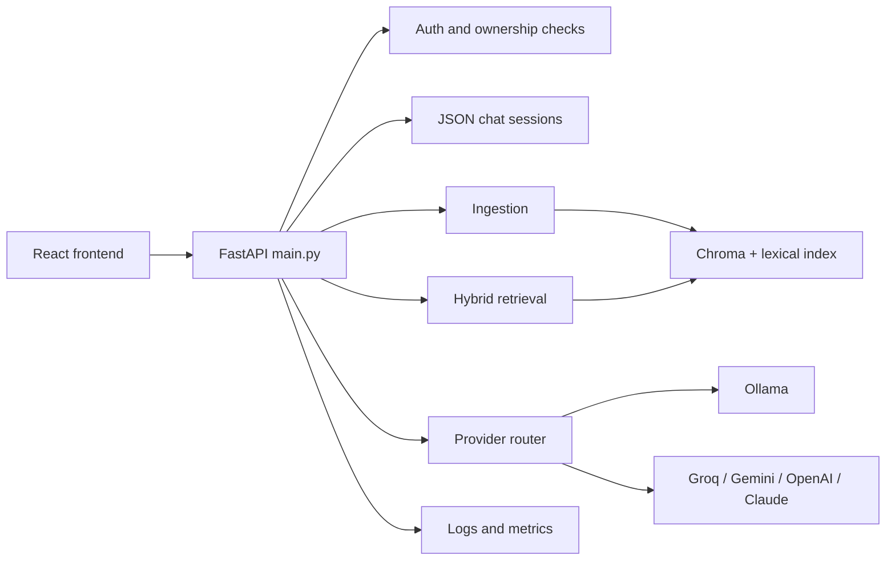
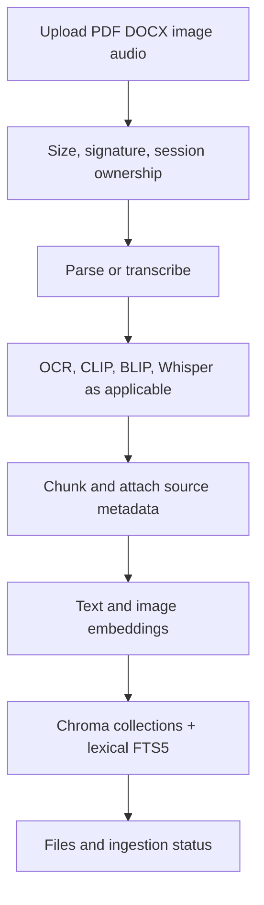
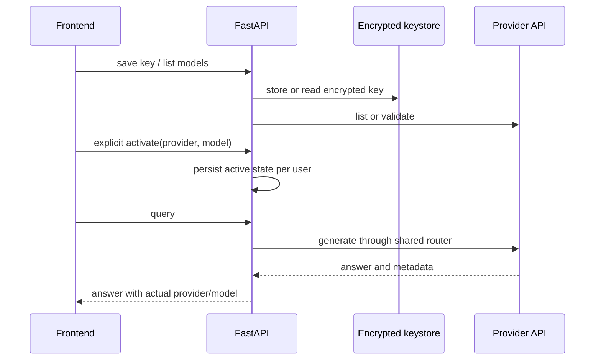
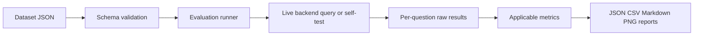

# Project Architecture Map

Status: initial audit, 2026-10-01. Facts below are based on the current source tree. Live provider and browser claims are deliberately marked unverified.

## Purpose and repository shape

This is a local-first multimodal RAG application for PDF, DOCX, image, and audio inputs. It has a React/Vite/TypeScript frontend, a FastAPI backend, JSON-file authentication and chat sessions, ChromaDB persistence, optional Redis caching, SentenceTransformers/CLIP embeddings, OCR/captioning/transcription pipelines, and Ollama or cloud generation providers.

Important directories:

- `backend/`: API, auth, sessions, ingestion, retrieval, generation, storage, and observability.
- `frontend/`: Vite React application and API client.
- `evaluation/`: datasets, metric functions, evaluators, provider adapters, runners, reports, and plots.
- `tests/`: security and backend/unit regression tests.
- `docs/`: operational, architecture, evaluation, security, and deployment guidance.
- `reports/`: generated or checked-in audit/report artifacts.

## Entry points and ownership

- Backend: `backend/main.py`, normally started from `backend/` with Uvicorn.
- Frontend: `frontend/src/main.tsx` and `frontend/src/App.tsx`, started with Vite.
- Offline evaluation: `python evaluation/run_eval.py ...` or `python -m evaluation.runner.run_eval ...` depending on the selected runner.
- Configuration: `backend/config.py`, environment variables, and provider-specific config files under `evaluation/config/`.
- Auth: `backend/auth.py`; encrypted provider keys: `backend/keystore.py`.
- Sessions: `backend/sessions.py`, one JSON file per session under configured storage.
- Provider state: `backend/generation/active_provider.py`, persisted per user without storing the key.

## High-level flow

## Ingestion

`/api/ingest` and `/api/ingest/async` validate ownership, save uploads inside the session directory, and call `backend/ingestion/ingest.py`. The pipeline parses supported documents, performs modality-specific OCR/captioning/transcription when configured, chunks text, generates embeddings, and persists scoped records in ChromaDB. Text ingestion also updates the persistent SQLite FTS5 lexical index. Async jobs are tracked by `/api/ingest/status/{job_id}`.

Repeated-ingestion and deletion semantics are implemented by the ingestion/vector-store code and should be treated as a test target before destructive re-ingestion. Do not clear the store as a validation shortcut.

## Retrieval and generation

`POST /api/query` and `POST /api/query/stream` verify the session owner, resolve the active provider/model, optionally rewrite or enhance the query, run dense text retrieval plus lexical retrieval and CLIP retrieval when applicable, fuse/rerank results, build a bounded citation-aware context, and call the shared answer/provider layer. The streaming route uses SSE. Query results persist user and assistant messages including provider, model, citations, and operational metrics.

## Providers and activation

`active_provider.py` stores only a user's selected provider and optional model. Cloud keys are stored through the encrypted keystore. Provider listing, key save/delete, validation, model listing, active-provider readback, and explicit activation routes are registered in `main.py`. `router.py` normalizes generation and streaming, classifies errors, retries selected transient failures, and can fail over only for configured retryable provider-health failures. The actual provider/model must be read from response metadata and stored with the message; frontend banner state alone is not proof.

## Chat sessions and isolation

Sessions contain owner ID, title, timestamps, messages, and file summaries. Routes call `_require_owner` before session/file operations. Writes are protected by an in-process per-session lock and atomic replacement; this does not provide multi-process file locking. Provider/model metadata is stored on assistant messages. Session-level quality evaluation is only valid when stored records can be joined to reference answers and relevance annotations.

## Evaluation and reporting

Datasets are JSON arrays validated by `evaluation/datasets/schema.py`. Required fields are `question_id`, `question`, and `category`; optional fields include relevant chunk/document IDs, required citations, and expected answers. Metric functions are mostly pure Python. Retrieval metrics include P@K, R@K, F1@K, hit rate, MRR, MAP, nDCG, and explicitly defined ROC/PR AUC when binary labels and scores exist. Generation metrics live in `generation_metrics.py`; compatibility wrappers remain in `retrieval_metrics.py`.

The current runner preserves failures and renders unavailable metrics as `NOT RUN`, but live provider runs and a real annotated corpus have not been executed in this audit environment.

## Configuration and constraints

Important variables include `OLLAMA_HOST`, `LLM_MODEL` (current default `qwen3:4b`), `OLLAMA_NUM_CTX`, `OLLAMA_NUM_PREDICT`, `OLLAMA_THINK`, `OLLAMA_STREAM`, `DEFAULT_PROVIDER`, `GROQ_MODEL`, `ALLOWED_ORIGINS`, storage/data paths, upload limits, and rate limits. Exact defaults are authoritative in `backend/config.py`; no secret values belong in documentation.

The deployment model documented by the repository is a local/single-process JSON/Chroma application. A multi-process deployment would require stronger file/database coordination. GPU, Ollama availability, external provider credentials, and a representative annotated corpus are prerequisites for live quality and provider-comparison claims.

## Verified baseline and limitations

- Verified: provider-router regression tests pass after aligning the fake provider with the model-aware contract.
- Verified: retrieval metric tests pass, including compatibility functions and ROC applicability behavior.
- Verified: touched evaluator modules compile.
- Verified: frontend production build, deterministic browser E2E, and full Python test suite (51 passed).
- Not yet verified: live Ollama, live Groq, browser E2E, Docker, dependency audit, and real-corpus reports.
- README quick-start model now matches the backend default `qwen3:4b`.