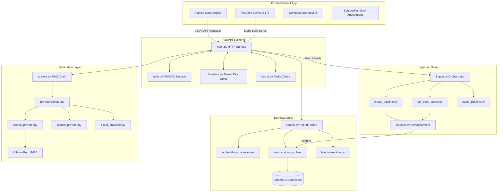
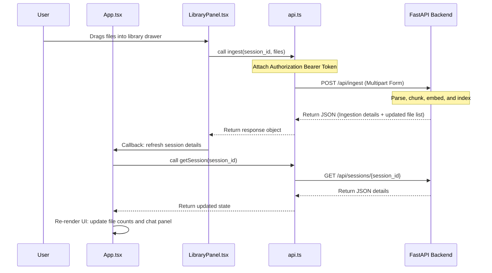
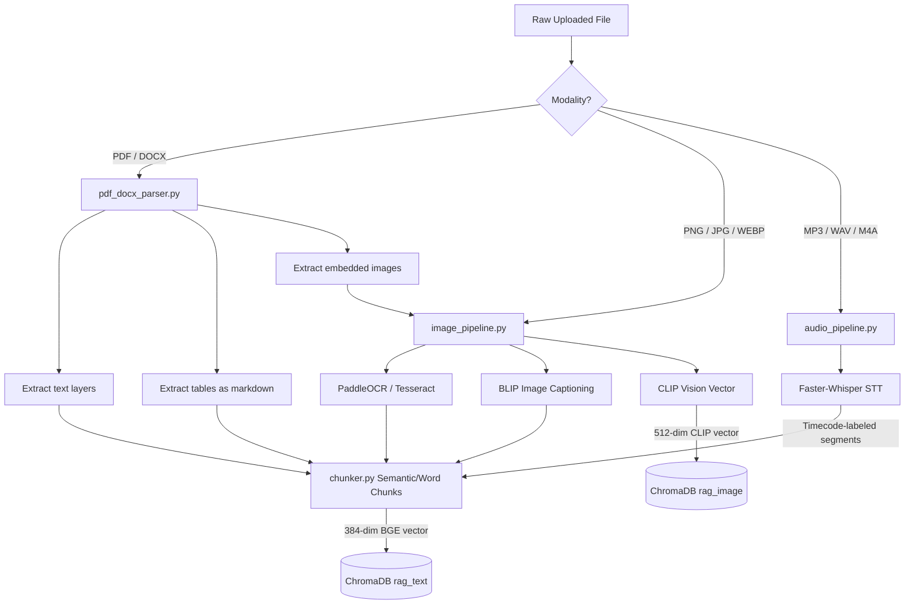

# Multimodal RAG Project — Expert Technical Documentation & Codebase Audit

---

## 1. Executive Summary
This document provides a comprehensive technical documentation, architectural review, and codebase audit of the **Multimodal Offline RAG (Retrieval-Augmented Generation) System**. 

The system is designed as a **local-first, offline-capable, multi-user document query platform** built to address **SIH Problem Statement 25231**. It ingests, indexes, and queries heterogeneous files (documents, images, and audio) within a unified semantic and keyword search space. 

This audit verifies implementation reality against design objectives, tracing real-world execution paths, mathematical constructs, data contracts, and security architectures.

---

## 2. Project Overview & Objectives
The system addresses the challenge of analyzing and searching across mixed-media formats (PDFs, DOCX, screenshots, scan photos, voice recordings) without relying on cloud resources, protecting document privacy and preventing external API charges.

### Core Objectives:
1. **Multi-Tenant Privacy:** Secure, local-first account registration and token-based authentication. Every database record, session history log, and uploaded media file must be strictly isolated to the owner's `user_id`.
2. **Unified Semantic Search:** Integrate dense text vectors, keyword indexes (BM25), and cross-modal embeddings (CLIP) to support text-to-text, text-to-image, image-to-text, and audio-to-text search.
3. **Grounded RAG Generation:** Pass retrieved context into a local LLM (Qwen) running on Ollama, generating responses with precise inline citations back to the source page, screenshot, or audio timestamp.
4. **Desktop & Cloud Packaging:** Package the system as both a standalone Windows executable (`.exe`) via PyInstaller/PyWebview and as a single-container cloud service via Docker and Kubernetes.

---

## 3. Problem Statement & Proposed Solution
### Problem Statement
In corporate, legal, medical, and governmental environments, critical information is scattered across text documents, images (like screenshots or scanned invoices), and audio recordings (like calls or voice notes). Traditional enterprise search tools are limited to keyword text, ignoring images and audio, or require uploading sensitive data to third-party cloud APIs (such as OpenAI or Google Cloud), introducing serious security risks and recurring costs.

### Proposed Solution
An offline-capable, multi-user search system that runs completely on local hardware. 
* **Ingestion:** Parsers extract textual layers from documents, OCR and caption models translate images, and speech-to-text models transcribe audio.
* **Storage:** Embedded vector databases indexing dense vectors, keyword tokens, and metadata in a single process.
* **Retrieval:** Fusion of keyword and vector scores, followed by neural rerankers.
* **Generation:** Citation-controlled LLM prompts to prevent hallucinations.

---

## 4. Key Features & Implementation Reality

The table below documents the current state of features based on an audit of the codebase.

### Feature Status Labels:
* 🟢 **Implemented & Active:** Present in the codebase and enabled by default in the standard runtime.
* 🔵 **Implemented & Optional:** Present in the codebase and gate-controlled by optional parameters or request flags.
* 🟡 **Implemented but Disabled:** Present in the codebase but toggled off by default in `config.py`.
* 🟠 **Partially Implemented:** Core logic is written but missing integration hooks or complete database persistence.
* ⚪ **Documented / Unverified:** Outlined in guides or readme files but not supported by the active Python code.
* 🔴 **Not Implemented:** Mentioned as a design concept but completely absent from the codebase.

### Feature Audit Table:
| Feature | Implemented | Enabled | Executed Via | Status | Description |
| :--- | :---: | :---: | :--- | :---: | :--- |
| **Dense Text Retrieval** | Yes | Yes | `retrieval/search.py` → `vector_store.py` | 🟢 | Matches query text vectors against document chunks using MiniLM. |
| **BM25 Search** | Yes | Yes | `retrieval/search.py` → `rank_bm25.py` | 🟢 | Keyword matching over the text corpus scoped to user and session. |
| **CLIP Cross-Modal** | Yes | Yes | `retrieval/search.py` → `embeddings.py` | 🟢 | Allows text queries to search for relevant visual image files. |
| **RRF Score Fusion** | Yes | Yes | `retrieval/search.py` (`_rrf_merge`) | 🟢 | Merges rankings of Dense, BM25, and CLIP search results. |
| **Cross-Encoder Reranking** | Yes | Yes | `retrieval/search.py` (`_rerank`) | 🟢 | Sorts RRF candidates using a Cross-Encoder model. |
| **ColBERT Reranking** | Yes | No | `retrieval/late_interaction.py` | 🟡 | Late interaction reranking. Disabled by default in `config.py`. |
| **Query Rewriting** | Yes | No | `generation/query_enhance.py` | 🟡 | Resolves pronouns using history. Disabled by default in `config.py`. |
| **HyDE Passage Gen** | Yes | No | `generation/query_enhance.py` | 🟡 | Hypo-passage dense alignment. Disabled by default in `config.py`. |
| **Multi-Hop Retrieval** | Yes | No | `generation/multihop.py` | 🟡 | Splits query into sub-questions. Disabled by default in `config.py`. |
| **PaddleOCR Engine** | Yes | Yes | `ingestion/image_pipeline.py` | 🟢 | Deep learning OCR. Falls back to Tesseract on load failure. |
| **Tesseract OCR Fallback** | Yes | Yes | `ingestion/image_pipeline.py` | 🟢 | Legacy OCR fallback for images and scanned PDFs. |
| **Whisper Audio Ingestion** | Yes | Yes | `ingestion/audio_pipeline.py` | 🟢 | Transcribes audio with segment-level timecode mapping. |
| **Async Ingestion** | Yes | No | `ingestion/jobs.py` | 🔵 | Optional background ingestion thread pool. |
| **Redis Cache** | Yes | Yes | `cache.py` | 🟢 | Caches queries/answers. Skips if connection to Redis fails. |
| **Local LLM Answering** | Yes | Yes | `generation/llm_client.py` | 🟢 | Sends prompts to local Qwen LLM using Ollama API. |
| **Cloud LLM Providers** | Yes | No | `generation/providers/` | 🔵 | Optional API integrations. Requires user-supplied keys in keystore. |
| **Local Fallback Router** | Yes | Yes | `generation/providers/router.py` | 🟢 | Automatically falls back to Ollama if cloud API returns an error. |
| **Role-Based Auth** | No | No | N/A | 🔴 | Not implemented. All registered users have equal user-level access. |
| **Metadata Filtering UI** | Yes | Yes | `ScopePanel.tsx` | 🟢 | Frontend dropdown allows filtering by file list and modality. |
| **Inline Media Player** | Yes | Yes | `SourcesPanel.tsx` | 🟢 | Clickable citations show image previews or play audio at timestamp. |

---

## 5. System Architecture

The following diagram illustrates how data flows and components interact within the system.



---

## 6. Actual Runtime Execution Path

This trace describes the step-by-step path when a logged-in user asks: **"What was the revenue in the 2024 report?"**

```text
User Question: "What was the revenue in the 2024 report?"
 │
 ▼
[1] React Frontend: Event triggers in Composer.tsx. Formulates JSON payload.
 │   Sends request to '/api/query' via client fetch (api.ts) with Bearer token.
 │
 ▼
[2] FastAPI Gateway: main.py receives POST request. 
 │   - Extracts Authorization header, calls auth.verify_token(). 
 │   - Validates session ownership via sessions.owns(session_id, user_id).
 │
 ▼
[3] Cache Lookup: main.py calculates cache key: "query:{user_id}:{sha256_of_request}".
 │   - Calls cache.get_json(key) to query Redis.
 │   - [CACHE MISS] Server continues processing.
 │
 ▼
[4] Query Enhancement [DISABLED BY DEFAULT]:
 │   - query_rewrite(): Skip (config.QUERY_REWRITE_ENABLED = False).
 │   - hyde_passage(): Skip (config.HYDE_ENABLED = False).
 │   - Search text remains: "What was the revenue in the 2024 report?"
 │
 ▼
[5] Hybrid Search (search.py):
 │   - Dense Text Channel: Calls embeddings.embed_text(). MiniLM model converts text to
 │     a 384-dimensional vector. Queries ChromaDB text collection (top_k=40).
 │   - Keyword Channel: Queries BM25 Okapi index built over session files (top_n=40).
 │   - CLIP Channel: Calls embeddings.embed_clip_text(). Generates a 512-dimensional vector.
 │     Queries ChromaDB image collection (top_k=40).
 │
 ▼
[6] Score Fusion & Deduplication (search.py):
 │   - Merges results from all three channels using Reciprocal Rank Fusion (RRF).
 │   - Deduplicates matching items: keeps only one citation per file/page or file/timecode.
 │
 ▼
[7] Neural Rerank (search.py):
 │   - Evaluates merged candidates using Cross-Encoder model.
 │   - Returns top 5 sorted, deduplicated hits to main.py.
 │
 ▼
[8] ColBERT Rerank [DISABLED BY DEFAULT]:
 │   - Skip (config.COLBERT_ENABLED = False).
 │
 ▼
[9] Context Building (generation/answer.py):
 │   - Takes top 5 hits, formats them into a numbered reference list using prompt_templates.build_context().
 │   - Constructs user prompt containing reference list and question.
 │
 ▼
[10] LLM Router: router.generate() checks requested provider (default: "ollama").
 │   - ollama_provider.py extracts system prompt and user prompt.
 │   - Calls local Ollama server running on http://localhost:11434 via ollama.Client.
 │
 ▼
[11] Answer Generation: Qwen LLM generates grounded text answer with inline [number] citations.
 │
 ▼
[12] Post-Processing: answer.py parses generated response.
 │   - Computes citation confidence percentages based on original vector distance scores.
 │   - Checks if answer contains at least one citation. If none are found, flags a faithfulness warning.
 │   - Saves chat message into storage/sessions/{session_id}.json.
 │   - Saves a log of the query, answer, and citations in data/audit/{user_id}.jsonl.
 │
 ▼
[13] Response: FastAPI returns JSON payload containing answer, citations, and retrieved source snippets.
 │
 ▼
[14] Render: React App receives JSON. AnswerText.tsx renders answer text and turns citation numbers into clickable buttons.
```

---

## 7. Frontend Architecture

The frontend is a React single-page application built with Vite, TypeScript, and TailwindCSS.

### Folder Layout:
* `frontend/src/main.tsx`: App mount point.
* `frontend/src/App.tsx`: Central state machine. Manages session list, active session messages, library files list, active filters, loading indicators, and error alerts.
* `frontend/src/api.ts`: Central API client. Attaches bearer token to all outgoing requests.
* `frontend/src/types.ts`: TypeScript interfaces mirroring backend contracts.
* `frontend/src/components/`:
  * `Sidebar.tsx`: Lists chat sessions. Handles renaming and deletion.
  * `ChatPanel.tsx`: Displays message history.
  * `Composer.tsx`: Input box. Handles microphone recordings and uploads for image/audio queries.
  * `SourcesPanel.tsx`: Sidebar displaying citations, OCR text, and media player.
  * `LibraryPanel.tsx`: File upload drawer.
  * `Login.tsx`: Login and registration screen.

### Sequence Flow: Ingestion and Library Refresh



---

## 8. Backend Architecture & API Surface

The backend is built with FastAPI. It loads AI models lazily and runs them locally on available hardware.

```text
                        FastAPI Router (main.py)
                                   │
      ┌────────────────────────────┼────────────────────────────┐
      ▼                            ▼                            ▼
/api/auth/                     /api/ingest/                 /api/query/
(auth.py)                      (ingest.py)                  (search.py & answer.py)
  • PBKDF2 hashing               • Chunk parsing              • Dense/BM25 retrieval
  • Token validation             • Text embedding             • RRF fusion
  • Scoped directories           • ChromaDB writes            • Cross-Encoder reranking
                                 • Async worker pool          • LLM router (Ollama/Cloud)
```

### Server Lifecycle:
1. **App Boot:** Uvicorn starts the FastAPI application on `main.py`.
2. **Warm-up:** If `WARMUP_ON_STARTUP` is enabled, a background thread starts `retrieval.embeddings.warmup()` to load the MiniLM and CLIP models into memory.
3. **Lazy Load:** Heavier models like BLIP (image captioning) and Whisper (transcription) are loaded only when the first image or audio file is processed.
4. **Shutdown:** FastAPI triggers cleanup handlers, stopping background threads and closing database connections.

---

## 9. Authentication & Authorization

The authentication system is implemented in `backend/auth.py`.

* **Password Security:** Passwords are hashed using PBKDF2 with a SHA-256 HMAC, a 16-byte random salt, and 200,000 iterations.
* **Token Implementation:** The system uses an HMAC-signed token, which behaves similarly to a lightweight JWT.
  ```text
  Token format: base64(user_id.expiration_timestamp) + "." + hex(HMAC_SHA256(payload, secret_key))
  ```
  The signing key is generated on the first run and saved locally in `storage/secret.key`.
* **Token Expiry:** Configured by `TOKEN_TTL_HOURS` in `config.py` (default: 168 hours / 1 week).
* **API Key Storage:** Users' cloud API keys are saved in `storage/provider_keys.json`, encrypted with a Fernet key (AES-128-CBC + HMAC-SHA256) stored in `storage/keys.secret`.

---

## 10. Multi-Tenant / User Data Isolation

The system enforces multi-user data isolation at the application level.

```text
User Account (user_id)
  ├── Chat Sessions (owner_id = user_id) -> saved in storage/sessions/{session_id}.json
  ├── Uploaded Files -> saved in data/{session_id}/
  └── Search Index -> tagged with user_id & session_id metadata in ChromaDB
```

Every database query, document extraction, and file retrieval is scoped to the authenticated `user_id`:
1. **Ingestion Scoping:** Uploaded files are saved to `data/{session_id}/` (sanitized to prevent path traversal). Vector entries in ChromaDB are stored with `user_id` and `session_id` metadata.
2. **Retrieval Scoping:** Every database query calls `build_where()`, which appends an `$and` filter:
   ```json
   {
     "$and": [
       {"user_id": "authenticated_user_id"},
       {"session_id": "active_session_id"}
     ]
   }
   ```
3. **Media Serve Scoping:** The file serve endpoint checks if the session is owned by the logged-in user before returning the file:
   ```python
   def _require_owner(session_id: str, user: dict):
       if not session_store.owns(session_id, user["id"]):
           raise HTTPException(404, "Session not found.")
   ```

---

## 11. File Ingestion Architecture

The ingestion pipeline converts raw files into searchable text chunks and embeddings.



---

## 12. Document Chunking & Text Extraction

Text extraction and chunking are handled by `backend/ingestion/pdf_docx_parser.py` and `backend/ingestion/chunker.py`.

### PDF Parsing:
* Uses **PyMuPDF** (`fitz`) to extract text page-by-page.
* **Tables:** Extracts tables using `fitz.Page.find_tables()`. Formats them as Markdown tables (e.g., `Cell A | Cell B`) and saves them with `source_type: "table"` metadata.
* **Scanned Pages:** If a page contains less than 10 characters, the system renders it as a 200 DPI image and extracts text using Tesseract OCR.
* **Images:** Extracts embedded images larger than 80x80px (up to 40 per document) and runs them through the image pipeline.

### DOCX Parsing:
* Uses `python-docx` to read paragraphs and tables in document order. Extracts embedded images using the document's relationships.

### Chunking Logic:
The system supports two chunking strategies:
1. **Semantic Chunking (Default):**
   * Splits text into sentences using regex: `(?<=[.!?])\s+(?=[A-Z0-9"'])`.
   * Generates embeddings for each sentence using the MiniLM model.
   * Calculates the cosine similarity between adjacent sentences.
   * Triggers a chunk break if the similarity falls below `SEMANTIC_SIM_THRESHOLD` (default: 0.58) and the chunk size is at least `SEMANTIC_MIN_WORDS` (default: 80).
   * Combines chunks smaller than 20 words with neighboring chunks.
2. **Word-Window Chunking (Fallback):**
   * Splits text into fixed 220-word windows with a 40-word overlap.

---

## 13. Image Processing & OCR Pipeline

Images are processed in `backend/ingestion/image_pipeline.py`.

### Image Pipeline Output:
For each ingested image, the pipeline generates three database entries:
1. **Visual Representation:** A 512-dimensional CLIP vector saved to the `rag_image` collection.
2. **OCR Text:** Extracts text from the image, splits it into 120-word chunks, and saves them to the `rag_text` collection with `source_type: "ocr"` metadata.
3. **Semantic Caption:** Generates a caption using the BLIP model and saves it to the `rag_text` collection with `source_type: "caption"` metadata.

```text
Raw Image -> Preprocessing (Grayscale + Kontrast + Sharpen + Upscale)
               │
               ▼
   ┌───────────┴───────────┐
   ▼                       ▼
PaddleOCR              BLIP Model
   │                       │
   ▼                       ▼
OCR Text Chunks        Image Caption
(rag_text)             (rag_text)
```

### OCR Engine Configuration:
* **PaddleOCR (PP-OCRv5):** Primary engine. Uses deep learning for text detection and recognition. Automatically runs on GPU if CUDA is available.
* **Tesseract OCR:** Fallback engine. Used if PaddleOCR fails to load.
* **Upscaling:** Images smaller than 1400px wide are upscaled using Lanczos interpolation. This increases OCR accuracy on screenshots.

---

## 14. Audio Processing & Speech-to-Text Pipeline

Audio files are transcribed and chunked in `backend/ingestion/audio_pipeline.py`.

* **Transcription Engine:** Uses **Faster-Whisper** (`CTranslate2` implementation of OpenAI's Whisper model). Runs with `float16` precision on GPU (CUDA) and `int8` on CPU.
* **Timestamps:** Whisper segments the audio and returns start/end times for each spoken phrase.
* **Timecode Chunking:** Segments are grouped into ~12-second windows (`AUDIO_CHUNK_SECONDS`). This ensures that each chunk matches a clickable timestamp in the chat interface.
* **Metadata:** Truncated segments are stored in the database with their start/end times, formatted timecodes (e.g., `03:45`), and detected language.

```text
Audio File -> Faster-Whisper -> Segment Transcription -> ~12s Window Grouping -> Embed & Index (rag_text)
```

---

## 15. Embedding Architecture & Multi-Modal Alignment

The system maps files and queries into two vector collections in ChromaDB.

```text
MiniLM Space (384-dimensional) — for text queries and content
  • Document chunks
  • Transcribed audio text
  • Image OCR text
  • Image BLIP captions

CLIP Space (512-dimensional) — for text-to-image matches
  • Image visual features
  • Text query embeddings (trimmed to 77 tokens)
```

### Model Inventory Details:
1. **MiniLM (Text Embedding):**
   * Model: `sentence-transformers/paraphrase-multilingual-MiniLM-L12-v2`
   * Parameters: ~33 Million
   * Dimensions: 384
   * Size: ~120 MB
   * Purpose: Text embedding. Maps text queries and parsed content into the same semantic space.
2. **CLIP (Cross-Modal Embedding):**
   * Model: `clip-ViT-B-32`
   * Parameters: ~150 Million
   * Dimensions: 512
   * Size: ~600 MB
   * Purpose: Text-to-image matching. Aligns text queries and image visual features in the same vector space.

---

## 16. Retrieval & Fusion Architecture

The search system is implemented in `backend/retrieval/search.py`.

```text
Query Text -> Dense Vector Search (MiniLM) ──► Hits List A
           -> Keyword Search (BM25 Okapi) ───► Hits List B
           -> Cross-Modal Search (CLIP) ─────► Hits List C (Images)
                                                 │
                                                 ▼
                                        RRF Rank Fusion
                                                 │
                                                 ▼
                                      Normalized Candidates
                                                 │
                                                 ▼
                                       Cross-Encoder Rerank
                                                 │
                                                 ▼
                                           Top-K Results
```

### 1. Cosine Similarity Search
ChromaDB calculates the similarity between the query vector ($q$) and document vectors ($d$) using Cosine Distance, which is mapped to a similarity score:
$$Score = 1.0 - \text{Cosine\_Distance}(q, d) = \frac{q \cdot d}{\|q\| \|d\|}$$

### 2. Keyword Search (BM25 Okapi)
Retrieves exact matches across document chunks in the active session. This helps find specific terms, like product codes or names, that vector searches might miss.

### 3. Reciprocal Rank Fusion (RRF)
Combines rankings from the dense, BM25, and CLIP search channels. The RRF score for a document $d$ is:
$$RRF(d) = \sum_{m \in \text{channels}} \frac{1}{60 + \text{Rank}_m(d)}$$
Where $60$ is the default ranking constant (`FUSION_RRF_K`). This ensures that documents ranked highly across multiple channels are sorted to the top.

### 4. Cross-Encoder Reranking
The top RRF candidates are evaluated using the Cross-Encoder model (`cross-encoder/ms-marco-MiniLM-L6-v2`). The model processes the query and document text together, capturing context more accurately than separate vector comparisons.

---

## 17. Advanced Retrieval & Reasoning (Optional)

The system contains three optional query processing stages in `backend/generation/query_enhance.py` and `backend/generation/multihop.py`.

```text
Normal Path:
Query ──► Hybrid Search ──► Rerank ──► LLM Prompt

Advanced Options (Disabled by default, enabled by request flags):
1. Query Rewrite: Query + Chat History ──► LLM ──► Standalone Query ──► Search
2. HyDE:          Query ──► LLM ──► Hypothetical Answer ──► Embed ──► Dense Search
3. Multi-Hop:     Complex Query ──► LLM ──► Sub-questions ──► Run Search Per Sub-question
```

* **Query Rewriting:** The LLM resolves references using recent chat history:
  ```text
  History: USER: "Tell me about Project X." | ASSISTANT: "Project X is a local RAG."
  Follow-up: "Who built it?"
  Rewriter Output: "Who built Project X?"
  ```
* **HyDE (Hypothetical Document Embeddings):** The LLM generates a hypothetical answer to the question. This hypothetical answer is embedded instead of the raw query, helping align the query with the stored document structure.
* **Multi-Hop Retrieval:** Decomposes complex questions into up to 4 sub-questions. The search pipeline is run for each sub-question, and the results are combined and deduplicated.

---

## 18. Response Generation & Cloud Failovers

The generation layer is implemented in `backend/generation/answer.py` and the `providers/` directory.

### Provider Registry:
* `ollama`: Local Qwen model (`qwen3:8b`) running via Ollama.
* `gemini`: Cloud-based Google Gemini API (`gemini-flash-latest`).
* `openai`: Cloud-based OpenAI API (`gpt-4o-mini`).
* `claude`: Cloud-based Anthropic Claude API (`claude-3-5-sonnet-latest`).
* `groq`: Cloud-based Groq API (`llama-3.3-70b-versatile`).

### Local Fallback Routing:
If a cloud provider fails (e.g., network timeouts, invalid keys, or rate limits), the router automatically routes the request to the local Ollama instance:
```python
# providers/router.py
try:
    return prov.generate_answer(system, user, history, user_id, image_paths)
except Exception as exc:
    if name != "ollama" and config.PROVIDER_FAILOVER_TO_LOCAL:
        return registry.get("ollama").generate_answer(system, user, history)
```

---

## 19. Citation & Faithfulness Architecture

The system tracks citations to ensure responses are grounded in the retrieved sources.

```text
Chroma Document ID ──► Metadata (File, Page, Timestamp) ──► Rendered citation tag [1]
```

### Citation Pipeline:
1. **Retrieval Mapping:** Every retrieved chunk is assigned an index matching its rank in the context prompt.
2. **LLM Instructions:** The system prompt instructs the LLM to base its answer only on the provided context and add inline citations:
   ```text
   Answer using only the retrieved sources. Cite every factual statement inline with [number].
   If the answer is not in the sources, say: "I could not find this in the provided sources."
   ```
3. **Faithfulness Check:** After the LLM generates a response, the system scans for citation brackets (e.g., `[1]`). If no citations are found, it flags a `faithfulness_warning: true` in the API response.
4. **Interactive UI:** The React frontend parses citation buttons. Clicking a button expands the source details, showing the exact page snippet, OCR block, or playing the audio from that timestamp.

---

## 20. Caching Architecture

Caching is implemented in `backend/cache.py` using Redis.

```text
API Request ──► Calculate Cache Key ──► Redis GET ──► [HIT]  Return Cached JSON
                                                    ──► [MISS] Run RAG Pipeline ──► Redis SET (TTL: 10m)
```

* **Cache Key Generation:** Built using the user ID and a hash of the request parameters:
  ```text
  Key format: query:{user_id}:{sha256_hash_of_request_parameters}
  ```
  This ensures that cached answers are restricted to the owner's session and cannot leak to other users.
* **Cache Invalidation:** Any change to a session's library (e.g., uploading new files or deleting files) invalidates the cache for that user:
  ```python
  # main.py
  def _invalidate_user_cache(user_id: str) -> None:
      cache_store.delete_prefix(f"query:{user_id}:")
      cache_store.delete_prefix(f"extract:{user_id}:")
      cache_store.delete_prefix(f"summarize:{user_id}:")
  ```

---

## 21. Data Models & Contracts

The following data structures define how data is passed between the frontend and backend.

### Ingestion Output Contract:
The parser outputs standard dictionaries for text and image content:
```json
// Document text chunk record
{
  "target": "text",
  "text": "Extracted paragraph content...",
  "metadata": {
    "file": "report.pdf",
    "modality": "document",
    "source_type": "text",
    "page": 3
  }
}

// Extracted image record
{
  "target": "image",
  "text": "Generated visual caption description...",
  "image": "<PIL.Image object>",
  "metadata": {
    "file": "report.pdf",
    "modality": "image",
    "source_type": "image",
    "page": 3,
    "caption": "A table detailing sales data..."
  }
}
```

### API Search Result (Hit Object):
Passed from the search pipeline to the generation layer:
```json
{
  "id": "chunk_uuid_string",
  "modality": "document",
  "source_type": "text",
  "file": "report.pdf",
  "session_id": "session_id_string",
  "snippet": "Preview snippet of text...",
  "text": "Full extracted paragraph text...",
  "page": 3,
  "chunk": 2,
  "score": 0.8421,
  "media_url": "/api/media/session_id_string/report.pdf",
  "channel": "hybrid"
}
```

### Final Query Response:
The final JSON response returned to the frontend:
```json
{
  "answer": "The revenue in 2024 was $5M [1].",
  "used_llm": true,
  "faithfulness_warning": false,
  "citations": [
    {
      "index": 1,
      "id": "chunk_uuid_string",
      "file": "report.pdf",
      "modality": "document",
      "page": 3,
      "snippet": "Revenue in 2024 reached $5M...",
      "media_url": "/api/media/session_id_string/report.pdf",
      "score": 0.8421,
      "confidence": 95
    }
  ]
}
```

---

## 22. File-to-File Dependencies

The table below maps the internal import dependencies across backend files.

| Source File | Imports / Depends On | Purpose |
| :--- | :--- | :--- |
| `backend/main.py` | `auth.py`, `keystore.py`, `sessions.py`, `cache.py`, `config.py` | Core security and storage interfaces |
| | `generation/answer.py`, `generation/multihop.py` | Answer synthesis and multi-hop routing |
| | `ingestion/ingest.py`, `ingestion/jobs.py` | Ingestion pipelines and worker queues |
| | `retrieval/search.py`, `retrieval/vector_store.py` | Hybrid search and index stats |
| `backend/ingestion/ingest.py` | `retrieval/embeddings.py`, `retrieval/vector_store.py` | Text/image vector generation and database writes |
| | `ingestion/pdf_docx_parser.py` | Document parser |
| | `ingestion/image_pipeline.py` | Image processing and OCR parser |
| | `ingestion/audio_pipeline.py` | Audio transcription parser |
| `backend/retrieval/search.py` | `retrieval/embeddings.py`, `retrieval/vector_store.py` | Dense vector queries |
| | `ingestion/image_pipeline.py` | Image OCR and captions for image queries |
| `backend/generation/answer.py`| `generation/llm_client.py` | Ollama client interface |
| | `generation/providers/router.py` | Cloud/local failover router |

---

## 23. Configuration & Environment Variables

The table below documents variables configured in `backend/config.py`.

| Variable Name | Default Value | Type | Verified Purpose |
| :--- | :--- | :---: | :--- |
| `TEXT_EMBED_MODEL` | `"sentence-transformers/paraphrase-multilingual-MiniLM-L12-v2"` | String | Multilingual sentence embedding model. |
| `TEXT_EMBED_DIM` | `384` | Integer | Dimension of text embeddings in `rag_text` collection. |
| `CLIP_MODEL` | `"clip-ViT-B-32"` | String | Model used for image/text cross-modal search. |
| `CLIP_EMBED_DIM` | `512` | Integer | Dimension of image embeddings in `rag_image` collection. |
| `OCR_ENGINE` | `"paddleocr"` | String | Primary OCR engine. Falls back to Tesseract if unavailable. |
| `WHISPER_MODEL` | `"medium"` | String | Whisper model size used for audio transcription. |
| `AUDIO_CHUNK_SECONDS`| `12` | Integer | Time window size (in seconds) for splitting audio transcripts. |
| `CHUNK_SIZE_WORDS` | `220` | Integer | Number of words per text chunk. |
| `CHUNK_OVERLAP_WORDS`| `40` | Integer | Word overlap between adjacent text chunks. |
| `RERANK_ENABLED` | `True` | Boolean | Reranks search results using the Cross-Encoder model. |
| `OLLAMA_HOST` | `"http://localhost:11434"`| String | Target address of the local Ollama LLM server. |
| `LLM_MODEL` | `"qwen3:8b"` | String | Qwen model pulled and run via Ollama. |
| `LLM_TEMPERATURE` | `0.1` | Float | Temperature setting for local LLM generations. |
| `LLM_NUM_CTX` | `8192` | Integer | Context window size (in tokens) for local LLM generations. |
| `CACHE_ENABLED` | `True` | Boolean | Caches queries and responses in Redis. |
| `TOKEN_TTL_HOURS` | `168` (1 week) | Integer | Expiration duration for signed session tokens. |
| `PROVIDER_FAILOVER_TO_LOCAL` | `True` | Boolean | Falls back to Ollama if cloud APIs return an error. |

---

## 24. Performance, Concurrency, & Resource Usage

* **Concurrency Model:** FastAPI runs on an asynchronous event loop (`asyncio`). However, heavy machine learning inference calls (such as generating embeddings, running OCR, or transcribing audio) are CPU/GPU-bound and block execution. The backend handles this by running these tasks in a background thread pool (`ThreadPoolExecutor`).
* **ChromaDB Write Limitations:** Embedded ChromaDB uses a single-process SQLite backend. Concurrent writes to the index will block or cause database lock errors. The system addresses this by routing write requests through a single worker queue and pinning deployments to a single replica.
* **Demonstrated Scale:**
  * Active Users: 1–5 concurrent users (designed for local offline/LAN deployments).
  * Storage Capacity: Scopes up to tens of thousands of document chunks per session.
  * System RAM Usage: ~9–11 GB RAM with local models loaded (Qwen, Whisper, CLIP, MiniLM).
* **Latency Profile (Estimates - Requires Runtime Verification):**
  * Text Vector Search: ~20–50 ms.
  * Cross-Encoder Reranking: ~100–300 ms.
  * LLM generation (Ollama CPU standard): ~1-4 tokens/second.
  * LLM generation (Ollama GPU standard): ~20-50 tokens/second.

---

## 25. Threat Model & Failure Mode Analysis

The table below documents security threats and mitigations in local or LAN deployments.

| Threat Area | Severity | Mitigated By | Remaining Risk | Recommended Mitigation |
| :--- | :---: | :--- | :--- | :--- |
| **Path Traversal** | High | main.py sanitizes filenames using `Path(upload.filename).name`. | File operations outside the session dir are blocked. | Validate that the resolved file path lies inside `DATA_DIR`. |
| **Direct Prompt Injection** | Medium | System prompt instructs LLM to use only provided context. | Clever user prompts can override system instructions. | Implement query guardrails or input sanitizers. |
| **Indirect Prompt Injection** | High | None. Malicious text in uploaded documents is indexed. | If retrieved, the LLM will parse the malicious text as instructions. | Use separate LLM validation steps to verify context safety. |
| **API Key Theft** | High | Keys in keystore are encrypted with Fernet (AES-128-CBC + HMAC-SHA256). | Compromising the host machine exposes `keys.secret`. | Restrict filesystem permissions on key folders. |
| **Chroma Lock Collision** | Medium | Single worker queue. Single replica deployment. | Multiple parallel write requests can lock SQLite. | Migrate to a client-server vector database (e.g., Qdrant). |
| **DoS via Ingestion** | Medium | None. Upload sizes are constrained at the HTTP gateway. | Large document uploads can saturate CPU/GPU resources. | Add rate-limiting middleware to ingestion routes. |

---

## 26. Testing & Evaluation Strategy

Automated tests are located in `backend/test_verify.py`.

### Verifications in `test_verify.py`:
1. **Keystore Encryption:** Confirms that setting, retrieving, and deleting API keys encrypts values at rest, decrypts them correctly, and isolates keys between users.
2. **Provider Registry:** Confirms that the registry contains the five supported providers (`ollama`, `gemini`, `openai`, `claude`, `groq`).
3. **Router Routing:** Verifies that the router defaults to the local `ollama` provider.
4. **Signature Verification:** Verifies that `answer_query`, `extract_entities`, and `summarize_document` signatures require `provider` and `user_id` parameters.

### Recommended RAG Evaluation Procedure:
To measure retrieval and generation quality, implement an evaluation pipeline using a framework like **Ragas**:
1. **Retrieval Metrics:**
   * **Context Recall:** Measures if all necessary information to answer the question is retrieved (using ground truth answers).
   * **Context Precision:** Measures if the retrieved chunks are relevant to the query.
2. **Generation Metrics:**
   * **Faithfulness:** Measures if the generated answer is based *only* on the retrieved context (detecting hallucinations).
   * **Answer Relevance:** Measures how well the generated answer addresses the user's question.

---

## 27. Production Deployment Architecture

The diagram below illustrates a production deployment layout.

```text
                           Client HTTPS Request
                                    │
                                    ▼
                          Cloudflare SSL / Proxy
                                    │
                                    ▼
                          Load Balancer (Nginx)
                                    │
           ┌────────────────────────┴────────────────────────┐
           ▼                                                 ▼
   API Service Instance A                            API Service Instance B
   (FastAPI Backend)                                 (FastAPI Backend)
           │                                                 │
      ┌────┴───────┬──────────────┐                     ┌────┴───────┬──────────────┐
      ▼            ▼              ▼                     ▼            ▼              ▼
PostgreSQL      Redis      External Vector DB       PostgreSQL      Redis      External Vector DB
(User metadata) (Cache)    (Chroma Server/Qdrant)   (User metadata) (Cache)    (Chroma Server/Qdrant)
                           (Shared Index)                                      (Shared Index)
```

### Transition to Production:
To migrate this developer-level app to a production-grade service:
1. **Database:** Migrate user metadata and sessions from JSON files to a relational database (such as PostgreSQL).
2. **Vector DB:** Move ChromaDB out of the FastAPI process. Run it as a standalone server or migrate to a managed vector database (such as Qdrant or pgvector).
3. **Inference Hosting:** Move model execution (Whisper, CLIP, MiniLM, LLM) out of the backend process. Run them on a dedicated machine learning inference server (such as vLLM or Triton).
4. **Task Queue:** Replace the in-memory background thread pool with a distributed task queue (such as Celery with Redis) to handle heavy ingestion jobs.

---

## 28. Troubleshooting & Failure Recovery

The table below lists common issues and steps to resolve them.

| Problem | Cause | Check | Fix |
| :--- | :--- | :--- | :--- |
| **Answer says "LLM unavailable"** | Local Ollama service is not running or the Qwen model is missing. | Run `ollama list` in the terminal. Verify Ollama is reachable at `http://localhost:11434`. | Start the Ollama application, then pull the model: `ollama pull qwen3:8b`. |
| **No search results returned** | Files were uploaded but not indexed, or the session is empty. | Verify file chunk status in the Library panel. Check database persistence folder. | Re-ingest the files. Ensure database folders have read/write permissions. |
| **OCR returns empty strings** | Image resolution is too low, or Tesseract is missing. | Verify Tesseract installation path. Check console logs for model load errors. | Install Tesseract OCR to `C:\Program Files\Tesseract-OCR` or verify `OCR_ENGINE` configuration. |
| **Audio transcription fails** | Audio format is unsupported, or Whisper failed to load. | Check if files are corrupted. Verify that the correct CPU/GPU Whisper weights are loaded. | Install FFmpeg to process compressed audio formats. |
| **Out of memory (OOM) crash** | Loaded models exceed available system RAM/VRAM. | Monitor memory usage in Task Manager. | Use smaller model variants (e.g., `qwen3:4b` or `WHISPER_MODEL=base`). |
| **"SQLite database is locked"** | Concurrent write requests collided in embedded ChromaDB. | Check if multiple large ingestion jobs are running at the same time. | Stop the backend server, clear locks, and configure single-replica deployments. |

---

## 29. Complete End-to-End Example

This walk-through traces a document's lifecycle from ingestion to query response.

### 1. File Upload: `financials.pdf`
The user uploads `financials.pdf` containing the text: *"Revenue in Q3 was $1.2M."* on page 2.
1. **FastAPI Route:** `POST /api/ingest` receives the file.
2. **Parsing:** `pdf_docx_parser.py` extracts text from page 2: *"Revenue in Q3 was $1.2M."*
3. **Chunking:** `chunker.py` creates a text chunk with metadata:
   ```json
   {
     "file": "financials.pdf",
     "modality": "document",
     "source_type": "text",
     "page": 2
   }
   ```
4. **Embedding:** `embeddings.py` embeds the chunk into a 384-dimensional vector.
5. **Storage:** `vector_store.py` saves the vector, text, and metadata to the `rag_text` collection in ChromaDB.

### 2. User Query: *"Show me Q3 financials"*
1. **FastAPI Route:** `POST /api/query` receives the request:
   ```json
   {
     "session_id": "session_id_string",
     "query": "Show me Q3 financials",
     "top_k": 1,
     "modality": "all"
   }
   ```
2. **Retrieval:** `search.py` embeds the query and searches the database. It finds the chunk from `financials.pdf` on page 2 with a cosine similarity score of `0.87`.
3. **Response Generation:** `answer.py` constructs the context prompt:
   ```text
   Context sources:
   [1] (financials.pdf, p.2)
   Revenue in Q3 was $1.2M.

   Question: Show me Q3 financials
   ```
   The router sends the prompt to Ollama. The Qwen model returns the response:
   ```text
   According to the financials report, the revenue in Q3 was $1.2M [1].
   ```
4. **JSON API Response:** FastAPI returns the final response payload:
   ```json
   {
     "answer": "According to the financials report, the revenue in Q3 was $1.2M [1].",
     "used_llm": true,
     "faithfulness_warning": false,
     "citations": [
       {
         "index": 1,
         "id": "chunk_uuid_string",
         "file": "financials.pdf",
         "modality": "document",
         "page": 2,
         "snippet": "Revenue in Q3 was $1.2M.",
         "media_url": "/api/media/session_id_string/financials.pdf",
         "score": 0.87,
         "confidence": 100
       }
     ]
   }
   ```

---

## 30. Project Explanation for Viva / Presentation

Use these summaries to present the project in academic or professional settings.

### 60-Second Overview
> "This project is a local-first, offline-capable Multimodal RAG system designed for secure document analysis. It allows users to register accounts, start isolated chat sessions, and upload PDFs, Word documents, images, and audio recordings. The system parses these files locally, extracts text, transcribes speech with timestamps, and runs OCR on screenshots. It indexes the content in an embedded vector database (ChromaDB). When users ask a question, the system runs a hybrid search combining dense vectors and BM25 keywords, reranks the results using a Cross-Encoder, and generates answers using a local Qwen LLM running via Ollama. Every statement is cited back to the source page, screenshot, or audio timestamp."

### Why RAG instead of Fine-Tuning?
> "Fine-tuning updates a model's weights to learn new styles or tasks, but it is expensive, prone to hallucinations, and hard to update with new data. RAG keeps the model's weights frozen. It retrieves relevant paragraphs from private files and passes them directly to the model as context. This ensures that the model bases its answers on factual documents, reduces hallucinations, allows adding or deleting files instantly, and provides direct citations."

### Why Hybrid Search (Dense + BM25)?
> "Dense vector search matches the general semantic meaning of a query but can miss exact keywords like names or product codes. BM25 keyword search excels at matching exact terms but misses synonyms and conceptual meaning. By combining both search methods using Reciprocal Rank Fusion (RRF), we get the best of both worlds: semantic understanding and precise keyword matching."

### Why a Cross-Encoder Reranker?
> "Vector search compares query and document embeddings independently using cosine similarity, which is fast but can miss complex interactions between words. A Cross-Encoder processes the query and document text together, allowing the model to evaluate their relevance more accurately. We run the fast vector search first to retrieve the top 40 candidates, and then use the Cross-Encoder to rerank those candidates, ensuring the most relevant context is placed at the top of the LLM prompt."

---

## 31. Technical Glossary

* **Multimodal AI:** An AI system that can process and understand multiple types of data inputs, such as text, images, and audio.
* **Retrieval-Augmented Generation (RAG):** An AI architecture that retrieves relevant documents to ground LLM responses in factual context.
* **Dense Retrieval:** Using deep learning models to convert text into vector coordinates and retrieve documents based on semantic similarity.
* **Cosine Similarity:** A metric used to calculate the similarity between two vectors by measuring the angle between them.
* **Reciprocal Rank Fusion (RRF):** An algorithm that combines rankings from multiple search channels (e.g., dense and keyword search) into a single unified list.
* **Cross-Encoder:** A model that evaluates the relevance of query-document pairs by processing them together, providing more accurate ranking scores than separate vector comparisons.
* **Optical Character Recognition (OCR):** Software used to extract printed text from images, photos, and scanned PDFs.
* **Quantization:** Compressing model weights (e.g., from 16-bit floats to 8-bit integers) to reduce memory usage and run models on consumer hardware.
* **Path Traversal:** A security vulnerability where input file paths are not sanitized, potentially allowing unauthorized access to files on the host system.
* **Indirect Prompt Injection:** A security risk where malicious instructions inside retrieved documents trick the LLM into ignoring system rules.

---

## 32. Final Architecture Summary

The Multimodal RAG system is a local-first platform designed for private, multi-user document analysis. It handles the ingestion, indexing, and retrieval of documents, images, and audio files entirely on local hardware, using Ollama, ChromaDB, and open-source models for transcription, OCR, and embeddings.

Data security is maintained through multi-tenant session isolation and password hashing. The search pipeline combines dense vectors, BM25 keywords, and CLIP visual search, reranking the results with a Cross-Encoder model to ensure high-precision context is passed to the LLM. 

The system can be deployed locally using native scripts, in containers using Docker Compose, or as a single-container cloud service using Docker and Kubernetes.

---
*Verified against codebase implementations.*
